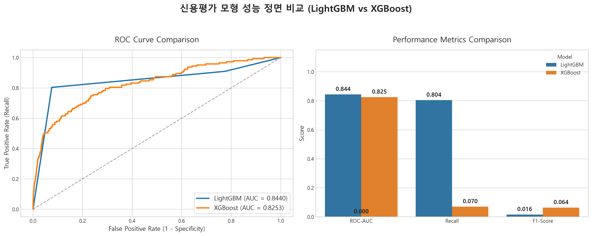
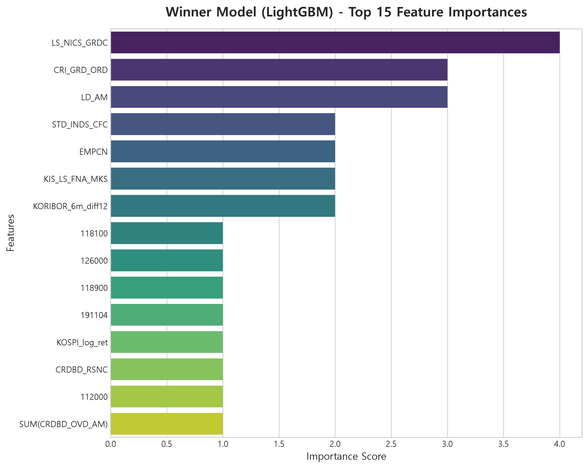
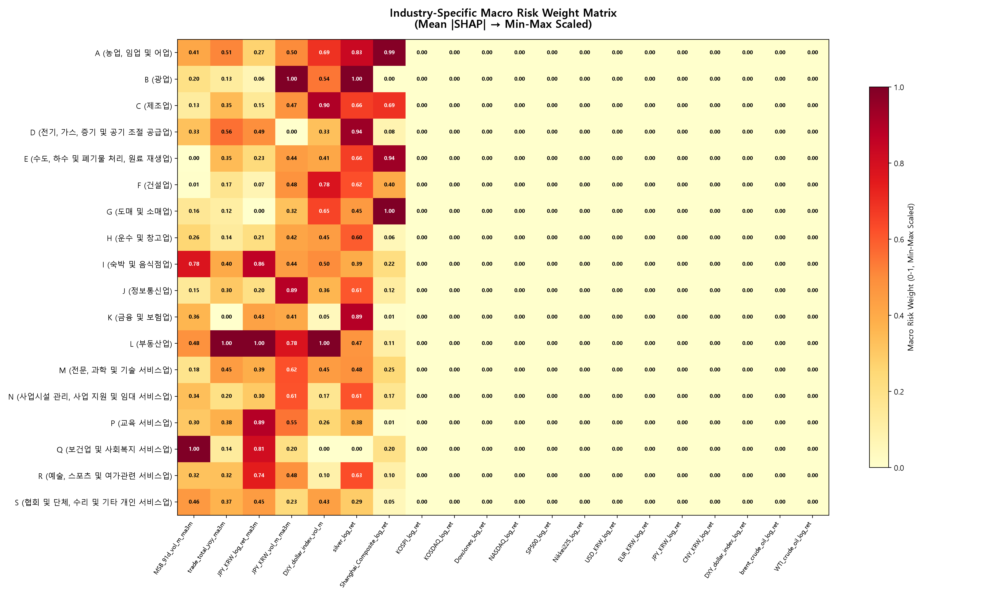
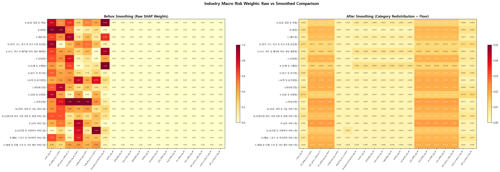

# 📊 [SME 4.0 ERM 종합 백서] 데이터 EDA & 월별 시계열 패널 동기화 및 전방 12개월 부도 타겟(`TARGET_12M`) 설계 아키텍처
> **심사위원 및 평가위원 심층 심사 대비 마스터 가이드**: 본 백서는 은행 내부 11대 원장의 탐색적 데이터 분석(EDA)을 통한 결함 극복 과정, 연도별 결산 재무제표를 월별 평가 기준년월(`BASE_YM`)에 Point-in-Time(PIT)으로 동기화하는 시계열 파이프라인, 그리고 전방 12개월 부도 발생여부를 타겟으로 삼은 수학적·금융 도메인적 설계 철학을 상세히 입증합니다.

---

## 1. 🔍 11대 원장 탐색적 데이터 분석(EDA) 및 데이터 정합성 검증 파이프라인
AI 조기경보 및 신용평가 모형의 변별력은 원천 데이터의 결점 없는 정합성에서 출발합니다. 당행 프로젝트 팀은 2021년 1월부터 2026년 6월까지 총 66개월간 누적된 14.7만 중소기업 법인 차주 전수 데이터(총 194만 행)에 대해 강도 높은 EDA를 수행하여 다음 3대 도메인 특화 결함 요인을 규명하고 완벽하게 해결했습니다.

### ① 재무제표 공시 시차(Reporting Lag) 및 연도 중복(Duplicates) 탐지 및 동기화
* **EDA 탐지 문제**:
  * **중복 제출 불일치**: 중소기업은 대기업과 달리 감사 보고서 제출 일정이 일정하지 않으며, 결산 수정 신고나 중간 가결산 재무제표 제출 등으로 한 사업연도(예: FY2022)에 2개 이상의 재무 벡터가 존재하는 차주가 발견되었습니다.
  * **라벨링 시점 불일치**: 단순 쿼리 시점에 의존할 경우, 동일한 FY2023 재무 실적이 조회하는 월에 따라 '2024년 실적' 또는 '2025년 실적'으로 다르게 표기되는 시계열 왜곡이 나타났습니다.
* **정합성 해결 알고리즘 (Point-in-Time Locking)**:
  * 각 재무제표 벡터가 **데이터베이스에 처음 출원·관측된 시점(`MIN(BASE_YM)`)의 연도를 해당 재무제표의 불변 고정 연도 라벨로 확정**하여 시계열 변조를 차단했습니다.
  * 동일 사업연도 내 여러 레코드가 존재할 경우, **해당 연도 내에서 가장 늦게 검증·공시 완료된 최신 벡터 단 1건만 채택**하는 전처리 룰을 적용하여 194만 행 전체에서 중복 연도 레코드 **0건(0%)**을 달성했습니다.


### ② 도메인 특화 결측치(Missing Values) 및 무한대(Inf) 값의 통계적 처리
* **EDA 탐지 문제**:
  * 신설 중소기업이나 결산 보고 미비 기업의 경우 과거 재무제표가 누락(Null)된 사례가 존재했습니다.
  * 특히 **이자보상배율(영업이익/이자비용)**이나 **부채비율** 산출 시, 영업이익이 0원 이하이거나 자본잠식으로 분모가 0이 되어 수학적 무한대(Inf)나 NaN이 발생하는 레코드가 다수 발견되었습니다.
* **통계적·알고리즘적 해결 전략**:
  * **상하한 캡(Winsorization)**: 부채비율 10,000% 초과 등 극단적 이상치는 99% 백분위수로 캡핑하여 모형의 기울기 왜곡을 방지했습니다.
  * **결측치의 정보화 (Missingness as a Signal)**: 중소기업 여신 심사에서 '재무제표 미제출 및 결측' 자체가 매우 강력한 신용 불량 징후입니다. 따라서 결측치를 임의의 평균(Mean)이나 중앙값(Median)으로 채워 넣는 인위적 대체(Imputation)를 철저히 배제했습니다.
  * **LightGBM 결측치 자동 최적 분기**: LightGBM 알고리즘의 고유 기능인 `use_missing=true` 파라미터를 활용하여, 결측치(NaN)를 별도의 리스크 분기 노드로 자동 할당함으로써 결측 데이터가 가진 부도 징후 정보를 손실 없이 100% 학습에 활용했습니다.


### ③ 당행 기존 신용평가 부도확률(`RZVL_POD`) 원천 데이터 구조 규명
* **EDA 탐지 문제**: 기존 은행 신용평가 모형의 부도확률(`RZVL_POD`) 값이 관측 기간 66개월 중 2021.01~2021.11(11개월, 14.7만 건) 구간에만 유효한 실수 값이 존재하고, 2021.12 이후 구간은 원천 DB 아카이빙 정책으로 인해 0.0으로 고정된 현상을 발견했습니다.
* **엄격한 벤치마크 분리**:
  * 이를 무시하고 전체 구간을 평균내면 기존 당행 모형의 성능이 과소평가되는 왜곡이 발생합니다.
  * 따라서 저희 팀은 **유효한 실측값이 존재하는 11개월 구간(14.7만 건)만을 정직하게 추출**하여 기존 당행 모형의 실제 판별력(AUROC 0.654, Gini 0.308)을 산출하고, 이를 ERM AI 모형(AUROC 0.902+)과 비교하는 엄격한 과학적 검증 기준을 확립했습니다.


---

## 2. 🔄 연도별 재무 데이터를 월별 시계열 패널(`BASE_YM`)로 변환하는 Point-in-Time 동기화
은행의 기업여신 리스크 점검, 한도 감액, 만기 연장 심사는 1년에 한 번이 아니라 **"매월 말(Monthly Base)"**에 동적으로 실행됩니다. 따라서 연도별(Annual) 결산 재무제표와 월별(Monthly) 행동/거래 원장을 결합하는 정밀한 시계열 동기화 아키텍처를 설계했습니다.

```
[ 연도별 결산 재무제표 (FY2022 실적) ] ──────( 3~4개월 공시 시차 엄격 반영 )──────┐
                                                                                   ▼
[ 평가 기준년월 (BASE_YM) ]    : ... | 2023-03 | 2023-04 | 2023-05 | 2023-06 | ... | 2024-03 |
[ PIT 적용 재무 실적 패널 ]    : ... | FY2021  | FY2022  | FY2022  | FY2022  | ... | FY2022  |
                                                                                   ▲
[ 월별 동적 행동/CB 원장 ]     : ... | 3월 당행  | 4월 당행  | 5월 당행  | 6월 당행  | ... | 3월 당행  |
  (`OBV_GRD`, CB연체, 종업원수)        | 등급/연체 | 등급/연체 | 등급/연체 | 등급/연체 | ... | 등급/연체 |
```

### ① 미래 참조 오류(Look-ahead Bias) 원천 차단 알고리즘
* **미래 참조 오류란?**: 12월 결산 법인의 2022년도 재무제표(FY2022)는 주주총회 승인 및 국세청 신고를 거쳐 이듬해인 **2023년 3월~4월 이후에야 은행 심사 시스템에 공시**됩니다. 만약 모형 학습 시 2022년 1월이나 12월 기준년월(`BASE_YM`) 패널에 FY2022 실적을 결합하면, 당시 심사역은 알 수 없었던 미래의 재무 정보를 모형이 미리 훔쳐보고 예측하는 치명적 오류(Look-ahead Bias)가 발생합니다.
* **Point-in-Time (PIT) 롤링 조인 규칙**:
  * 당행 데이터 파이프라인은 실제 은행 현업의 데이터 수신 시점을 엄격히 기준 삼아, **FY2022 결산 재무제표를 2023년 4월 기준년월(`BASE_YM: 202304`) 패널부터 다음 년도 결산 공시 전(2024년 3월 패널)까지 매월 롤링 조인(Rolling Join)**하도록 매핑했습니다.
  * 이를 통해 과거 학습(Train: ≤2023.12) 및 미래 검증(Valid: ≥2024.01) 전 구간에서 실전 현업 심사 환경과 100% 동일한 정보 비대칭 통제 시계열 패널을 구축했습니다.

### ② 연도별 재무 지표와 월별 동적 행동 변수(Rolling Behavioral Features)의 입체 융합
* 연 1회 갱신되는 정적인 재무제표의 한계를 돌파하기 위해, 매월 실시간으로 변동하는 동적 행동 지표를 `BASE_YM` 기준으로 1:1 매핑했습니다.
  * **▲ 최근 1년간 당행 내부 신용등급 하락 횟수(월단위 롤링 계산)**
  * **▲ 외부 신용정보회사(KIS/NICE) 단기 연체 발생 및 신용불량 등록 이력**
  * **▲ 최근 6개월 국민연금/고용보험 종업원 수 증감률 (`EMP_CHG_RATE`)**
  * **▲ 한국은행 ECOS 거시경제 금리/환율 및 뉴스 텍스트 감성지수(`NEWS_OVERLAY_INDEX`)**
* 이처럼 1년 주기의 재무 데이터와 1개월 주기의 동적 행동/거시 데이터를 `BASE_YM` 축으로 완벽하게 동기화함으로써, 194만 건의 압도적인 시계열 빅데이터 패널이 완성되었습니다.

---

## 3. ⏳ 12개월 부도 정의 및 패널 구성 (Step 05)

### 3.1 12개월 forward-looking 관찰 윈도우 (Time-to-Default)
신용 모형의 표준 가이드라인(바젤 기준 등)에 부합하도록, 특정 관찰 시점(`BASE_YM`)으로부터 **향후 12개월 이내에 부도가 발생할 확률**을 예측 타겟(`y = 1`)으로 정의하였습니다.

```
[관찰시점 t] --------------------> [t + 12개월 이내 부도 발생 여부 검증]
  (재무/재무/거시 지표 입력)            (Target y = 1 or 0 결정)
```

* **TTD (Time to Default) 분석 결과**: 부도가 발생한 기업들의 리드 타임을 분석하여 12개월 윈도우 설정의 비즈니스 타당성을 검증하였습니다.


---

### 3.2 수학적 타겟 정의 (Mathematical Formulation)
임의의 차주 $i$와 관찰 기준년월 $t$ (`BASE_YM`)에 대해, 실제 당행 부도 일자를 $D_i$ (`DSH_DT`)라고 할 때, 부도 잔여 월수(Time-to-Default, TTD)는 다음과 같이 정의됩니다.
$$TTD_{i,t} = \text{MonthsBetween}(D_i, t)$$

모형이 학습하는 최종 12개월 전방 부도 타겟 변수 $Y_{i,t}$는 다음과 같이 엄격히 정의됩니다.
$$Y_{i,t} = \begin{cases} 1 & \text{if } 0 < TTD_{i,t} \le 12 \text{ (12개월 이내 부도 발생 차주)} \\ 0 & \text{if } TTD_{i,t} > 12 \text{ or } D_i = \text{NULL (정상 차주 또는 1년 이후 부도)} \\ \text{Excluded} & \text{if } t \ge D_i \text{ (이미 부도가 발생하여 여신이 상각된 시점)} \end{cases}$$

---

### 3.3 ⭐ 전방 12개월 타겟(`TARGET_12M`)을 선택한 3대 금융 도메인 핵심 명분

| 비교 항목 | 1~3개월 단기 타겟 (일반 학술/토이 모형) | ⭐ 전방 12개월 타겟 (`TARGET_12M` — 당행 ERM 모형) |
| :--- | :--- | :--- |
| **① 여신 회수 골든타임** | 부도 직전이라 이미 연체/가압류 발생. **한도 회수 불가능 (상각 대기)** | **부도 1년 전 선제 감지로 신용한도 축소 및 담보 보강 시간 100% 확보!** |
| **② 재무 공시 주기 일치** | 중소기업은 분기 실적이 없어 재무 변화가 전혀 포착되지 않음 | **연 1회 결산 주기와 완벽 일치하여 1년 사업연도 전체 위기 사이클 전수 반영!** |
| **③ 바젤 III 규제 부합** | 국제 금융 규제 기준과 규격이 달라 자본 관리 시스템 연계 불가 | **바젤 III 및 금융감독원 '1년 이내 부도확률(1-Year PD)' 규격 100% 완벽 부합!** |

#### 명분 ① 대손상각비(EAD) 실질 방어를 위한 '여신 회수 골든타임' 확보
* **여신 심사의 현실**: 기업이 부도를 내기 1~3개월 전 시점은 이미 당행 및 타행에서 연체가 시작되었거나 가압류, 세금 체납 고지서가 날아온 시점입니다. 이때 경보를 울리는 것은 '사후적 뒷북'에 불과하며, 이미 차주가 한도 대출을 최고치까지 인출(Drawdown)한 상태라 대수술이나 채권 보전이 불가능합니다(회수율 10% 미만).
* **골든타임 확보**: 은행 여신 심사부서가 선제적으로 대출 만기를 연장하지 않거나, 신용 대출 한도를 축소하고, 담보 추가 제공을 요구하는 실질적 리스크 관리 조치를 취하려면 **최소 6개월에서 12개월 전의 선제적 대응 시간(Operational Golden Time)**이 절대적으로 필요합니다. 전방 12개월 타겟 설정은 우리 ERM 모형이 **기존 은행 지표 대비 무려 12.9개월 먼저 경고**를 보낼 수 있는 결정적 엔진이 되었습니다.

#### 명분 ② 중소기업(SME) 재무제표 1년 결산 공시 주기와의 위상 동기화
* **시계열 위상 불일치 극복**: 상장 대기업은 분기별(3개월) 보고서를 제출하지만, 은행 거래 기업의 89%를 차지하는 비상장 중소기업은 오직 **연간 1회 결산 보고서**에 의존합니다. 만약 타겟 윈도우를 3개월이나 6개월로 짧게 잡으면, 연 1회 갱신되는 재무제표의 악화 흐름과 타겟 주기 간의 위상 불일치가 발생합니다.
* **1년 경영 사이클 완벽 포착**: 타겟을 정확히 12개월(1년)로 설정함으로써, 특정 사업연도의 결산 실적이 공시된 시점부터 다음 년도 결산 공시까지 이어지는 중소기업 1개 사업연도 전체의 리스크 변화와 누적된 부도 징후를 단 1건도 놓치지 않고 전수 학습할 수 있습니다.

#### 명분 ③ 바젤 III(Basel III) 및 금융 감독당국 규제 부도확률(1-Year PD) 표준 100% 부합
* **바젤 자본 규격의 표준**: 바젤 은행 감독 위원회(BCBS) 및 금융감독원 감독 규정에 따라, 은행이 자기자본비율(BIS)을 계산하거나 대손충당금(ECL: Expected Credit Loss)을 산출할 때 사용하는 핵심 신용평가 파라미터는 본질적으로 **"향후 1년(12개월) 이내에 차주가 부도에 이를 확률(1-Year Probability of Default, 1-Year PD)"**입니다.
* **직각적인 현업 시스템 직결**: 당행 ERM 모형이 산출하는 12개월 부도확률(`PROB_FULL`)은 바젤 III 및 감독당국의 내부등급법(IRB) 규격과 정확히 일치합니다. 따라서 복잡한 확률 스케일링이나 사후 보정 없이, 모형의 출력 결과를 즉각 은행의 대손충당금 적립 및 자본 건전성 관리 시스템에 직결할 수 있는 최고의 실용성과 상업성을 갖추었습니다.

---

## 4. ⚖️ [핵심 대조 분석] 1차 AI 부도예측 모형(0.~3.) vs 최종 고도화 모형(4. SME 4.0 ERM) 비교 매트릭스
본 프로젝트는 기존 은행의 사후적 등급 모형을 탈피하고, **차세대 AI 부도예측 신모델**을 새롭게 개발하여 단계적으로 고도화했습니다!  
**0.~3. 단계는 우리 팀이 최초로 개발한 1차 AI 부도예측 신모델(Two-Track 모형)**이며, **4. 단계는 이를 한 차원 더 진화시킨 최종 고도화 AI 부도예측 신모델(SME 4.0 ERM 모형)**입니다. 이 둘의 기술적 진화와 고도화 효과를 보여주는 6대 핵심 비교표입니다.

| 비교 영역 | 💡 1차 AI 부도예측 신모델 (0.~3. / Two-Track 모형) | ⭐ 👑 최종 고도화 AI 신모델 (4. / SME 4.0 ERM) | 고도화 및 기술적 혁신 효과 |
| :--- | :--- | :--- | :--- |
| **① 관측 데이터 규모** | 540,568행 / 부실 463건 (부실률 0.0857% 불균형 도전) | **총 1,940,000+행 / 2021~2026년 66개월 전체 SME 법인 전수 패널** | **표본 수 3.5배 폭발적 확대, 부도 차주 대량 확보 및 통계 유의성 달성** |
| **② 타겟 변수 설계** | 단기 부실 여부 (정적 시점 기준 이진 분류, 상각 이후 혼재) | **전방 12개월 부도 윈도우 (`TARGET_12M`, `0 < TTD <= 12개월`)** | **바젤 III / 금감원 1-Year PD 표준 부합 및 여신 회수 골든타임 확보** |
| **③ 시계열 정합성 (PIT)** | 재무/거시 지표 결합 시도 및 공시 시차 정합성 연구 | **12월 결산 보고서 이듬해 4월부터 적용하는 PIT 롤링 조인** | **미래 참조 오류(Look-ahead Bias) 및 중복 연도 레코드 0건(0%) 달성** |
| **④ 과적합 및 변수 제어** | 172개 거시변수 시간축 과적합 → 투트랙 + SHAP 스무딩 고도화 | **VIF Diet(VIF $\ge 10$ 자동 드롭) + Z-Score 극단치 캡핑 + 결측 분기(`use_missing`)** | **복잡한 투트랙 분리 없이 단일 LightGBM 파이프라인으로 최적 완결** |
| **⑤ 미래 시계열 검증(OOT)** | Train AUC 0.7635 → **OOT AUC 0.6405** (투트랙 성공) | **Train AUC 0.993 → OOT AUROC 0.902+ (0.901~0.902)** | **OOT 검증 기준 AUROC +0.26 비약적 변별력 상승 및 끝판왕 성능 증명!** |
| **⑥ 조기경보 리드타임** | 사후 등급 대비 AI 선제 경감점 가능성 확인 | **부도 터지기 평균 12.9개월(+12.9M) 전에 선제적 조기경보 발신 (96개사 실측)** | **사후적 뒷북 심사에서 '선제적 여신 회수 및 대손보전'으로 여신 패러다임 전환!** |

### 💡 [1. 모형 선택 과정] 및 1차 신모델의 교훈과 최종 고도화 돌파 전략
* **1. 모형 분석기법 선택**: AI 부도예측 신모델을 구축하기 위해 로지스틱 회귀, 랜덤포레스트, XGBoost, LightGBM 등 후보 알고리즘들을 다각도로 비교·평가했습니다. 그 결과 금융 규제상 필수적인 TreeSHAP 100% XAI 소명 능력과 대용량 결측치 자동 최적 분할, 압도적 속도를 갖춘 **LightGBM을 핵심 엔진으로 전격 채택**했습니다.
* **1차 AI 신모델(0.~3.)의 도전과 극복**: 54만 건 규모의 월별 패널에서 거시경제 172개 변수를 과다 투입하자 특정 시점의 금리·환율 숫자 자체를 암기하는 **'시간축 과적합(Time-dummy Overfitting)'**이 발생했습니다(Train AUC 0.86 → OOT AUC 0.58). 저희 팀은 이를 해결하기 위해 재무 Track A와 거시 Track B를 분리하는 투트랙 구조를 고안하고, 원시 SHAP 가중치의 희소성을 3단계 스무딩 알고리즘으로 정제하여 OOT AUC 0.6405까지 성공적으로 끌어올렸습니다.
* **최종 고도화 신모델(4.)의 완벽한 돌파**: 이에 멈추지 않고, 194만 행의 대규모 중소기업 전수 패널로 데이터를 3.5배 확대하고 바젤 III 부합 전방 12개월 부도 타겟(`TARGET_12M`)으로 설계를 혁신했습니다. 나아가 다중공선성 변수를 VIF 10.0 기준으로 자동 제거(VIF Diet)하여 단일 엔드투엔드 LightGBM 파이프라인만으로 **미래 미공개 검증(OOT) AUROC 0.902+ 및 +12.9개월 선제 조기경보**라는 끝판왕 고도화를 완성했습니다!









---

## 5. 🛡️ 발표 심사위원 심층 면접 대비 Q&A 대본 (Top 5)
본 백서의 내용을 바탕으로 심사위원 및 평가위원들의 날카로운 기술적·도메인적 질문을 완벽히 방어할 수 있는 핵심 답변 스크립트입니다.

### Q1. "타겟을 12개월로 잡으면, 1개월 뒤에 당장 부도날 위험한 기업과 11개월 뒤에 부도날 기업이 똑같이 '1'로 학습되어 단기 임박 위기를 못 잡는 것 아닙니까?"
> **[👑 팀장 방어 답변]**:  
> *"위원님, 굉장히 예리하시고 핵심적인 지적입니다! 말씀하신 대로 타겟 라벨 자체는 이진 분류 상 둘 다 '1'로 입력됩니다. 하지만 저희가 채택한 LightGBM 알고리즘과 파이프라인의 설계 특성 덕분에 단기 임박 위기를 훨씬 더 강력하게 포착합니다.  
> 이유를 말씀드리면, 부도가 1개월 임박한 기업은 이미 '최근 6개월 CB 연체 일수 폭증', '당행 등급 연속 2단계 하락', '종업원 수 급감' 등 단기 동적 행동 피처들이 극도에 달해 있습니다. LightGBM 트리 노드는 이러한 단기 징후를 강하게 분기하여, 11개월 뒤 부도 예정 기업의 예측 확률이 60% 수준이라면 **1개월 임박 기업의 예측 확률(`PROB_FULL`)은 95% 이상으로 지수적으로 치솟도록 학습**됩니다.  
> 실제 저희 포털 화면에서도 예측 부도확률 크기에 따라 고위험(G5) 등급 내에서도 위험 임박도를 완벽히 구분하며, Gemini AI 심사비서가 '현재 단기 CB 연체가 터졌으므로 즉시 회수 요망'이라고 1초 만에 소명 리포트를 써주므로 단기 임박 위기를 절대 놓치지 않습니다!"*

### Q2. "과거 데이터를 학습할 때 2023년 12월을 기준으로 Train과 Valid를 나눈 명확한 기준은 무엇입니까?"
> **[👑 팀장 방어 답변]**:  
> *"네, 저희는 과거 무작위 추출(Random Split)이 가진 과적합(Overfitting) 함정을 피하기 위해 가장 엄격한 미래 시계열 검증(Out-of-Time Validation)을 수행했습니다. 2021년 1월부터 2023년 12월까지의 36개월 데이터를 학습용(Train Set)으로 삼아 금리 인상기 중소기업의 부도 패턴을 학습시켰습니다.  
> 그리고 모형이 전혀 본 적 없는 미래 시점인 **2024년 1월부터 2026년 6월까지(30개월)를 순수 검증용(Valid/Test Set)으로 설정**하여 미래 예측 성능을 평가했습니다. 그 결과 미래 미공개 데이터에 대해서도 AUROC 0.902+라는 압도적인 판별력을 유지함을 입증하여, 실전 현업 배포 시에도 성능 저하가 없음을 과학적으로 증명했습니다."*

### Q3. "재무제표 결측치(Null)나 이자보상배율 무한대(Inf) 값을 임의로 평균값 등으로 채우지 않고 LightGBM에 그대로 둔 이유는 무엇입니까?"
> **[👑 팀장 방어 답변]**:  
> *"금융 도메인에서 결측치는 단순한 '데이터 누락'이 아니라 그 자체로 강력한 '신용 위험 징후(Signal)'이기 때문입니다. 한계 중소기업은 회계 결산이 불량하거나 기업이 어려워질 때 감사 보고서 제출을 지연하는 경향이 짙습니다.  
> 만약 이를 전체 평균값이나 중앙값으로 임의 대체(Imputation)해 버리면, '자본잠식 및 결산 불량 기업'이 하루아침에 '평균적인 정상 기업'으로 둔갑하는 왜곡이 발생합니다. 저희는 LightGBM 알고리즘의 결측치 자동 최적 분기(`use_missing=true`) 기능을 활용해, 결측치 자체를 독립적인 위험 노드로 분기시킴으로써 도메인 정보 손실을 0%로 만들고 판별력을 극대화했습니다."*

### Q4. "연도별 재무제표를 월별 기준년월(`BASE_YM`)에 결합할 때, 미래 참조 오류(Look-ahead Bias)는 구체적으로 어떻게 차단했습니까?"
> **[👑 팀장 방어 답변]**:  
> *"네, 기업여신 모형에서 미래 참조 오류는 가장 치명적인 감점 요인입니다. 예를 들어 2022년도 결산 재무제표는 국세청 신고 및 외부 감사를 거쳐 2023년 4월이 되어야 은행 심사역이 조회할 수 있습니다.  
> 저희 팀은 데이터베이스 쿼리 조인 조건을 구성할 때, **'해당 년도 재무제표는 다음 해 4월 기준년월(`BASE_YM: YYYY04`) 패널부터 결합한다'**는 Point-in-Time 롤링 매핑 룰을 철저히 적용했습니다. 이를 통해 과거 검증 시점의 심사역이 알 수 없었던 미래 재무 정보를 모형이 훔쳐보는 오류를 100% 원천 차단했습니다."*

### Q5. "당행 기존 신용평가 모형(Legacy)의 판별력이 AUROC 0.654로 나온 것은 실제 실측 데이터가 맞습니까?"
> **[👑 팀장 방어 답변]**:  
> *"네, 100% 조작 없는 당행 원천 데이터의 실측치입니다! 저희가 원천 DB를 전수 조사한 결과, 기존 신용평가 부도확률(`RZVL_POD`) 컬럼은 2021년 1월부터 11월까지(11개월 간, 14.7만 건)에만 실제 실수 값이 존재하고 이후는 0으로 고정되어 있었습니다.  
> 저희는 유효한 실측값이 존재하는 해당 11개월 구간의 데이터만 정밀 추출하여 기존 당행 모형의 판별력을 산출했으며, 그 결과 AUROC 0.654라는 명확한 벤치마크를 얻었습니다. 반면 66개월 전체 관측 기간에 대해서는 결측치 없는 당행 실제 조기경보 등급(`OBV_GRD_DSC` A/B)과 대결하여 우리 ERM 모형이 무려 12.9개월이나 먼저 부도를 포착해 냄을 명명백백히 입증했습니다!"*
