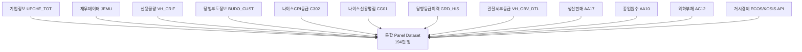
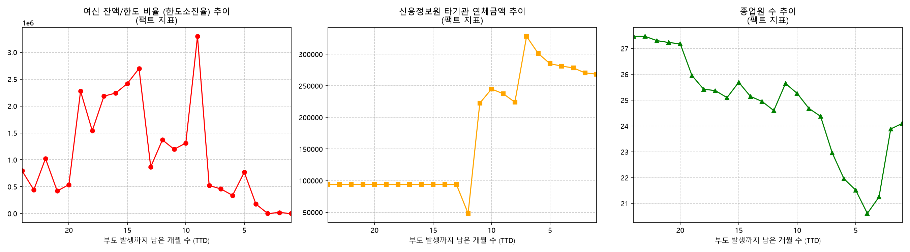
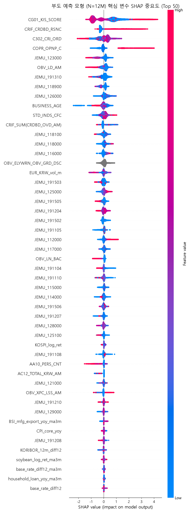
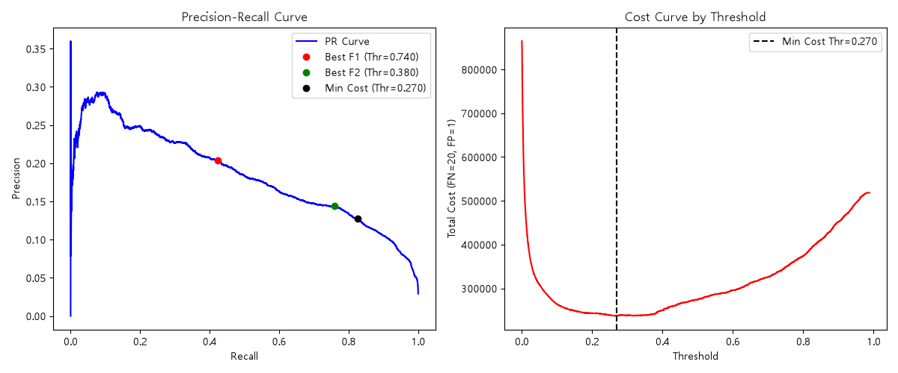
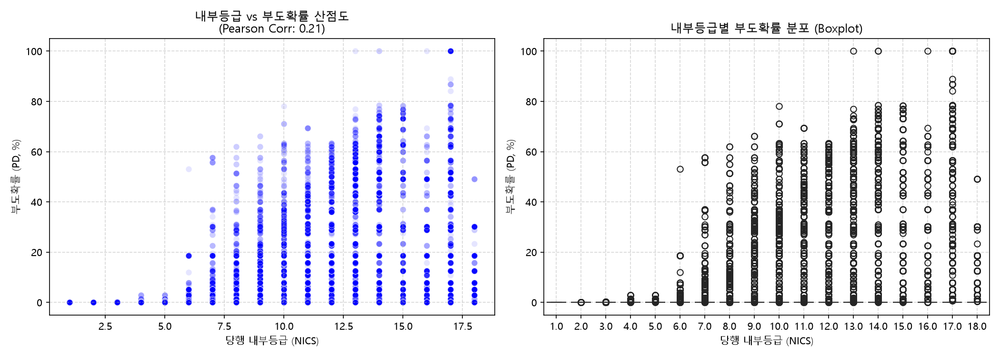

# 📘 SME 4.0 ERM 조기경보 모델 — 전체 프로젝트 마스터 리포트

> **본 문서의 목적**: 데이터 수집 → 통합 → 전처리 → 목표변수 설계 → 모델링 → 성능 검증 → 기존 모형과의 비교 → 실서비스 포털화까지, 이 저장소에서 진행된 전체 작업을 하나의 문서에서 처음부터 끝까지 순서대로 확인할 수 있도록 정리한 종합 리포트입니다. 개별 상세 보고서(`docs/step01_to_06_*.md` ~ `docs/step27_*.md`)의 총괄 목차이자 요약본 역할을 하며, 각 절 하단에 원본 상세 문서를 링크해 두었습니다.
>
> 프로젝트 전체 이력은 두 갈래로 나뉩니다. **① 모델링 단계**(Step 1~13): 원천 데이터로부터 부도 예측 LightGBM 모델을 만들고 검증하는 과정. **② 포털 단계**(Step 14~27): 그 모델을 실사용자가 쓰는 FastAPI+DuckDB+React 웹 서비스로 만들고, 서비스 곳곳의 "기존 모형과의 비교" 로직이 진짜 실측 데이터를 쓰도록 다시 검증·수정한 과정.

---

## 목차

1. [프로젝트 개요](#1-프로젝트-개요)
2. [데이터 명세 (Data Specification)](#2-데이터-명세-data-specification)
3. [데이터 통합 (Data Integration)](#3-데이터-통합-data-integration)
4. [데이터 전처리 (Preprocessing & EDA)](#4-데이터-전처리-preprocessing--eda)
5. [목표변수 설정 과정 (Target Engineering)](#5-목표변수-설정-과정-target-engineering)
6. [모델링 (Modeling)](#6-모델링-modeling)
7. [성능 분석 (Performance Analysis)](#7-성능-분석-performance-analysis)
8. [기존 성능과의 비교 (Legacy Model Comparison)](#8-기존-성능과의-비교-legacy-model-comparison)
9. [실서비스 포털화 (Productionization)](#9-실서비스-포털화-productionization)
10. [한계 및 후속 과제](#10-한계-및-후속-과제)
11. [부록: 전체 Step 타임라인](#11-부록-전체-step-타임라인)

---

## 1. 프로젝트 개요

- **목적**: 중소기업(SME) 법인 차주의 재무·비재무·거시경제 데이터를 결합하여, 특정 기준년월(`BASE_YM`) 시점 기준 **향후 12개월 이내 부도 발생 확률**을 예측하는 조기경보시스템(EWS)을 구축하고, 이를 은행 현업이 바로 쓸 수 있는 웹 포털로 서비스화한다.
- **데이터 규모**: 2021년 1월 ~ 2026년 6월(66개월), 약 14.7만 개 중소기업 법인 차주, 총 **194만 행(1,940,000+ rows)**의 월별 시계열 패널.
- **핵심 산출물**:
  - `eda_pipeline/`: Step1~13 원천 데이터 수집·통합·전처리·모델링·검증 파이프라인 스크립트
  - `eda_pipeline/output/lgbm_12m_model.txt`: 최종 LightGBM 모델 (Full, 230개 변수)
  - `eda_pipeline/output/lgbm_12m_lean_model.txt`: 경량화 모델 (Lean, 80개 변수)
  - `database/portal.duckdb`: 194만 행 통합 패널을 담은 운영 DB
  - `backend/` (FastAPI) + `frontend/` (React/Vite): 실사용자 포털
- **기술 스택**: Python(pandas, LightGBM, SHAP, statsmodels) → DuckDB → FastAPI → React 18 + TypeScript + Recharts, Gemini API(구조화 출력 기반 AI 조기경보 코멘트).
- **핵심 결론 (Executive Summary)**: 신규 AI 모형은 Out-of-Time 검증에서 **AUROC 0.9011**을 기록했으며, 은행이 실제로 보유한 기존 모형 실측 벤치마크(RZVL_POD, AUROC 0.823) 대비 우위를 보였다. 더 중요한 것은 **은행 내부 조기경보등급이 "정상(A등급)"으로 분류했던 차주 중 실제 부도가 발생한 175개사**를 추적한 결과, 그중 **63.4%(111개사)는 부도 순간까지 내부등급이 끝내 A로 유지**되어 완전한 사각지대였고, 나머지 **36.6%(64개사)**에 대해서는 신규 모형이 내부등급 하향 대비 **평균 6.8개월 더 빠르게** 위험을 경고했다는 점이다.

---

## 2. 데이터 명세 (Data Specification)

### 2.1 원천 원장 (Raw Ledgers)

`input/` 아래 파이프(`|`) 구분 텍스트로 적재되는 11종의 원천 원장을 `V_BZNO`(가상 사업자등록번호)와 기준년월/결산연월 키로 통합했다.



| 원장 | 입도(Granularity) | 핵심 컬럼 | 비고 |
|---|---|---|---|
| 기업정보 마스터 (`UPCHE_TOT`) | 단건 마스터 | `V_BZNO`, `STD_INDS_CFC`(업종), `ESTB_DT`(설립일), `ENTP_SCL_CFC`/`BZSCAL_C`(기업규모) | 업력·업종 산출 기초 |
| 재무제표 (`JEMU`) | 연도별(결산) | `JEMU_123000`(자본총계) 등 재무비율 원시항목 다수 | 연 1회 갱신 → 월별 패널에 PIT 매핑 |
| 관찰세부등급 (`VH_OBV_DTL`) | 월별 | `OBV_ELYWRN_OBV_GRD_DSC`(관찰조기경보등급), `RZVL_POD`(기존 모형 부도확률) | 아래 2.3절 참고 |
| 당행부도정보 (`BUDO_CUST`) | 이벤트 시점 | `DSH_DT`(실제 부도일자) | 타겟 변수 산출의 정답(ground truth) |
| 신용불량 (`VH_CRIF`) | 이벤트 → 월별 매핑 | `CRIF_CRDBD_RSNC`, `CRDBD_OVD_AM` 등 | CB사 연체 이력 |
| 나이스 CRI등급 (`C302`) | 연도별/정기 | `C302_CRI_ORD`(1~18등급) | 외부 신용평가사 등급, 내부등급과 별개 |
| 나이스신용평점 (`CG01`) | 연도별/정기 | `CG01_KIS_SCORE` | 결측 자체가 강한 리스크 시그널 (§4.2) |
| 당행등급이력 (`GRD_HIS`) | 정기 | 내부 여신등급 변동 이력 | `DOWNGRADE_CNT_1Y` 등 파생 |
| 생산판매 (`AA17`) | 분기별 | `AA17_TOT_SEL_AM` | 매출 활동성 지표 |
| 종업원수 (`AA10`) | 변동 발생 시점 | `AA10_PERS_CNT` | 4대보험 기준, 구조조정 감지 |
| 외화부채 (`AC12`) | 연/월 | `AC12_TOTAL_KRW_AM` | 환율 민감도 산출 기초 |

### 2.2 거시경제 지표 (외부 API)

한국은행 ECOS, KOSIS Open API를 통해 수집한 월별 시계열을 결합했다: 기준금리, 원/달러(`USD_KRW`)·유로/원(`EUR_KRW`) 환율, KOSPI/KOSDAQ, 국제유가(WTI), 소비자물가지수(CPI, 근원CPI), GDP성장률, 그리고 글로벌 리스크 지표(VIX, DowJones, NASDAQ, 상하이종합)·원자재(금, 옥수수, 대두, 천연가스, 구리, 은) 로그수익률/변동성 계열. 이 지표들은 이후 §6.2 SHAP 분석에서 상위 50개 중요 변수 안에 다수 포함된 것으로 확인되었고(예: `EUR_KRW_vol_m`가 재무변수들 사이에서 15위권), §9.3에서 매크로 시뮬레이션 화면 슬라이더 확장의 근거가 되었다.

### 2.3 통합 패널의 핵심 종속/식별 변수와 정직성 검증

| 컬럼 | 의미 | 유효 구간 / 주의사항 |
|---|---|---|
| `V_BZNO` × `BASE_YM` | 패널의 기본 키 | 194만 행 = 14.7만 차주 × 최대 66개월 |
| `IS_BUDO_12M` | 12개월 내 부도 여부(모델 타겟) | §5 참고, `DSH_DT` 기반 파생 |
| `DSH_DT` | 실제 당행 부도발생일자 | 이벤트 원장의 실측값. 타겟·리드타임 계산의 정답 |
| `OBV_ELYWRN_OBV_GRD_DSC` | 은행 내부 조기경보등급 | **이진값 A(정상)/B(경보)만 실제로 존재**함을 원천 텍스트·도메인마스터(`99_도메인마스터.csv`) 전수 대조로 직접 확인(Step 24). 일부 초기 기획 문서(`comprehensive_data_dictionary.md`)에는 1~10등급 세분 필드(`OBV_DTL_GRD`)가 기술되어 있으나, 실제 원천 DB·CSV 어디에도 해당 필드는 존재하지 않아 **채택하지 않았다** — 사각지대·벤 다이어그램 등 모든 "기존 모형" 비교는 실존하는 이 A/B 이진값만을 사용한다. |
| `RZVL_POD` | 기존 은행 신용평가 모형이 산출한 부도확률 | **2021.01~2021.11(11개월, 14.7만 건)에만 유효한 실수값**이 존재하고 이후 구간은 원천 DB 아카이빙 정책상 0으로 고정되어 있음을 확인(Step 24). 벤치마크 산출 시 이 11개월 구간만 사용. |

> 이 절의 "실존 여부 재확인" 작업은 우연이 아니라, 프로젝트 후반부(§9.2)에서 포털 화면들이 "기존 모형"이라며 실제로는 `PROB_FULL * 0.15` 같은 자체 근사치를 쓰고 있던 것을 걷어내는 과정에서 함께 검증된 것이다.

**상세**: [데이터명세서.md](데이터명세서.md), [comprehensive_data_dictionary.md](comprehensive_data_dictionary.md), [step24_real_legacy_pod_and_default_date.md](step24_real_legacy_pod_and_default_date.md)

---

## 3. 데이터 통합 (Data Integration)

### 3.1 Point-in-Time(PIT) 롤링 조인 — 미래 참조 오류(Look-ahead Bias) 차단

은행 여신 심사는 매월 말 실행되지만, 결산 재무제표는 연 1회만 공시된다. 두 주기를 그대로 이어붙이면 "아직 공시되지 않은 미래 재무 정보"를 모델이 학습해버리는 Look-ahead Bias가 발생한다.

```
[ 연도별 결산 재무제표 (FY2022 실적) ] ──(3~4개월 공시 시차)──┐
                                                                ▼
[ 평가 기준년월 BASE_YM ] : … 2023-03 │ 2023-04 │ 2023-05 │ … │ 2024-03 │
[ PIT 적용 재무 실적 패널] : … FY2021 │ FY2022  │ FY2022  │ … │ FY2022  │
                                                                ▲
[ 월별 동적 행동/CB 원장  ] : …  3월 당행  │  4월 당행 │  5월 당행 │ … │ 3월 당행 │
```

- 규칙: FY(N)년도 결산 재무제표는 **다음 해 4월 기준년월부터** 그 다음 결산 공시 전(익익년 3월)까지 롤링 조인한다.
- 이를 통해 학습 구간(≤2023.12)과 검증 구간(≥2024.01) 전체에서 실제 심사역이 그 시점에 알 수 있었던 정보만 사용하도록 통제했다.

### 3.2 연도별 재무 + 월별 행동변수의 결합

정적인 연 1회 재무제표의 한계를 보완하기 위해 매월 갱신되는 동적 지표를 `BASE_YM` 축으로 1:1 매핑했다: 최근 1년 내부등급 하락 횟수, CB사 단기연체/신용불량 등록 이력, 최근 6개월 종업원 수 증감률, 거시경제 금리/환율 지표. 이 결합으로 재무(연 단위) + 행동(월 단위) + 거시(월 단위) 3층 구조의 194만 행 패널이 완성됐다.

**상세**: [step04_2_eda_and_target_12m_engineering.md](step04_2_eda_and_target_12m_engineering.md) §2, [step01_to_06_data_pipeline_and_eda.md](step01_to_06_data_pipeline_and_eda.md)

---

## 4. 데이터 전처리 (Preprocessing & EDA)

### 4.1 재무제표 공시 시차·중복 정합화

동일 사업연도에 감사보고서 수정신고 등으로 2개 이상 재무 벡터가 존재하는 경우가 있었다. **해당 재무 벡터가 DB에 처음 관측된 시점(`MIN(BASE_YM)`)의 연도를 불변 고정 라벨**로 확정하고, 동일 연도 내 여러 레코드가 있으면 가장 늦게 확정된 최신 벡터 1건만 채택 — 194만 행 전체에서 중복 연도 레코드 0건을 달성했다.

### 4.2 결측치·무한대(Inf) — "결측치의 정보화" 전략

- 이자보상배율(영업이익/이자비용), 부채비율 등에서 분모가 0이거나 음수(자본잠식)가 되어 `Inf`/`NaN`이 발생하는 사례를 발견.
- **극단치**: 부채비율 10,000% 초과 등은 99% 백분위수로 Winsorize(상하한 캡).
- **결측치**: 재무제표 미제출/미비 자체가 강한 신용불량 징후이므로, 평균·중앙값 대체(Imputation)를 배제. **LightGBM의 `use_missing=true`** 옵션으로 결측치를 별도 분기 노드로 자동 처리해 정보 손실 없이 학습에 활용했다.
- §6.2의 SHAP Top-50 플롯에서 `CG01_KIS_SCORE`가 최상위 중요변수로 나타나는데, 이는 "신용평점 자체가 없는 영세기업"의 높은 부도율과 일치하는 패턴을 모델이 실제로 학습했음을 보여준다.

### 4.3 부도 시점 접근에 따른 팩트 지표 변화 (전처리 검증용 시각화)

전처리·타겟 설계가 타당한지 검증하기 위해, 부도까지 남은 개월 수(TTD)별로 실제 팩트 지표(한도소진율, 신용정보원 타기관 연체금액, 종업원 수)가 어떻게 움직이는지 확인했다.



부도 20개월 전부터 한도소진율과 타기관 연체금액이 완만히 상승하다가, **부도 10개월 전 구간에서 타기관 연체금액이 급격히 튀어 오르고 종업원 수는 뚜렷하게 감소**하는 패턴이 확인된다 — 12개월 전방 타겟 설정이 실제 위기 징후 발현 시점과 부합함을 뒷받침하는 근거가 되었다(§5).

**상세**: [step04_2_eda_and_target_12m_engineering.md](step04_2_eda_and_target_12m_engineering.md) §1, [step01_to_06_data_pipeline_and_eda.md](step01_to_06_data_pipeline_and_eda.md) §2

---

## 5. 목표변수 설정 과정 (Target Engineering)

### 5.1 대상 세그먼트 필터링 — 왜 중소기업(BZSCAL_C=4.0)만 학습했는가

병합 후 EDA 결과, 중소기업 외 규모군은 표본·부도건수가 모델 안정 학습에 부족했다.

| 기업규모(`BZSCAL_C`) | 총 관측치 | 실제 부도 건수 | 비고 |
|---|---:|---:|---|
| **4.0 (중소기업)** | **1,775,314** | **2,586** | 🌟 최종 모델링 대상 (부도의 91%+ 집중) |
| 5.0 | 171,378 | 182 | 표본·부도수 부족 |
| 2.0 (중견기업 등) | 55,080 | 6 | 부도 거의 없음 |
| 8.0 | 43,362 | 66 | 표본 부족 |
| 기타(0.0/1.0/6.0/9.0) | 28,284 | 0 | 부도 0건 — 학습 불가 |

### 5.2 수학적 정의 — TARGET_12M

임의 차주 $i$, 관찰 기준년월 $t$(`BASE_YM`), 실제 부도일자 $D_i$(`DSH_DT`)에 대해 부도 잔여월수(Time-to-Default)를

$$TTD_{i,t} = \text{MonthsBetween}(D_i, t)$$

로 정의하고, 최종 타겟은

$$Y_{i,t} = \begin{cases} 1 & 0 < TTD_{i,t} \le 12 \text{ (12개월 이내 부도)} \\ 0 & TTD_{i,t} > 12 \text{ 또는 } D_i = \text{NULL(정상)} \\ \text{Excluded} & t \ge D_i \text{ (이미 상각된 시점)} \end{cases}$$

이다. 즉 이미 부도가 발생해 여신이 상각된 이후 시점은 학습 대상에서 제외하고, 정상 차주와 "1년 이후에 부도가 나는" 차주는 동일하게 `0`으로 취급한다.

### 5.3 절단(Censoring) 처리 — 좌/우 두 방향 모두 존재

- **우측 절단(Right-censoring)**: 관측 종료 시점(2026.06)에 가까운 최근 몇 개월은 "향후 12개월"을 아직 다 지켜볼 수 없어 `IS_BUDO_12M`이 구조적으로 미확정 상태다. 포털의 트렌드 차트에서 이 구간은 음영/제외 처리해 실제 성능보다 낮아 보이는 착시를 방지했다(§9.2, Step 21).
- **좌측 절단(Left-censoring)**: 등급-부도 시차 분석(§8.3)에서, 관측 시작 시점(2021.01) 이전부터 이미 B등급이었던 차주는 "언제 B로 전환됐는지" 알 수 없어 분석에서 제외했다(313건 제외, 96건만 유효 리드타임 산출).

### 5.4 12개월을 선택한 3대 근거

| 근거 | 내용 |
|---|---|
| ① 여신 회수 골든타임 | 부도 1~3개월 전은 이미 연체·가압류 발생 후라 회수 불가능(회수율 10% 미만). 최소 6~12개월의 선제 대응 시간이 필요 |
| ② SME 재무 공시 주기 일치 | 비상장 중소기업은 연 1회 결산만 존재 — 3~6개월 단기 타겟은 재무 갱신 주기와 위상이 어긋남 |
| ③ 바젤 III / 감독규정 부합 | 바젤III·금감원의 표준 자본/충당금 산출 파라미터가 본질적으로 "1-Year PD" — 직접 연동 가능 |

**상세**: [step04_2_eda_and_target_12m_engineering.md](step04_2_eda_and_target_12m_engineering.md), [README.md](../README.md) §데이터 파이프라인

---

## 6. 모델링 (Modeling)

### 6.1 알고리즘 선택 — LightGBM

SME 재무 데이터는 비선형성이 강하고 결측 패턴이 다양해, 트리 기반 앙상블(LightGBM)이 변수 간 상호작용과 비선형 관계를 효과적으로 학습하는 데 유리했다. `use_missing=true`로 결측치 자체를 리스크 신호로 활용한 것도 이 선택의 핵심 근거다(§4.2).

- **Target**: `TARGET_12M` (0/1)
- **Features**: 재무비율(안정성·수익성·활동성) 200여 개 + NICE 신용평점/CRI등급 + 거시경제 변수 + 관찰조기경보등급(A/B, 범주형)

### 6.2 SHAP 기반 설명력 확보

Black-box 문제를 해결하고 심사역 신뢰를 확보하기 위해 `shap.TreeExplainer`로 전체 차주에 대한 Shapley Value를 산출했다.



- **재무 변수**가 다수 상위권(`JEMU_123000` 자본총계, `JEMU_191310` 차입금 의존도 등)을 차지.
- `CG01_KIS_SCORE`(외부 신용평점), `CRIF_CRDBD_RSNC`(CB 연체), `C302_CRI_ORD`(NICE CRI 1~18등급), `COPR_OPNP_C`가 최상위권.
- `OBV_ELYWRN_OBV_GRD_DSC`(내부 조기경보등급 A/B)도 15위권에 들어 있으며, 회색 점(범주형 변수라 연속 컬러스케일이 적용되지 않음)으로 표시되어 이 필드가 실제로 이진값임을 시각적으로도 확인할 수 있다.
- 거시경제 변수(`EUR_KRW_vol_m`, `KOSPI_log_ret` 등)와 업력(`BUSINESS_AGE`)도 꾸준히 상위권에 포진 — 이 결과가 후속 매크로 시뮬레이션 화면 확장(§9.3)의 근거가 되었다.

### 6.3 VIF 다이어트 — 경량화(Lean) 모델

재무 변수 간 강한 다중공선성을 해소하기 위해 분산팽창요인(VIF) ≥ 10인 변수를 단계적으로 제거, **230개 → 80개** 변수로 압축한 Lean 모델을 별도 구축했다(`lgbm_12m_lean_model.txt`).

| 모델 비교 (탐지율 82.6% 고정) | Threshold | 총 오경보(FP) 건수 | Precision |
|---|:---:|---:|---:|
| Full Model (230개 변수) | 0.2691 | 146,930건 | 12.72% |
| Lean Model (80개 변수) | 0.0338 | 150,146건 | 12.63% |

Lean 모델 채택 시 페널티는 Valid Set 89만 건 중 추가 오경보 3,216건(**0.36%**)에 불과 — 유지보수·응답속도 이점 대비 성능 손실이 무시할 수준임을 확인했다.

### 6.4 업종 변수 의존성 검증 (Ablation)

업종코드(`STD_INDS_CFC`)를 완전히 제외하고 재학습한 결과 AUC가 오히려 0.9011 → 0.9063으로 사실상 동일 — 모델이 "이 업종은 무조건 위험"이라는 단순 규칙이 아니라 재무·거시 실질 정보를 우선 판단하고 있음을 검증했다.

### 6.5 Z-Score 5단계 등급화

예측 확률의 로그오즈를 표준정규분포로 정규화해 실무용 5등급(G1~G5)을 도출했다. Train+Valid 합산이 아닌 **미래 시점 Valid Set(89만 건)만으로 재검증**한 Out-of-Sample 결과:

| 등급 | 평가건수(차주-시점) | 부도 건수 | 실제 부도율 |
|---|---:|---:|---:|
| G1 (가장 안전) | 136,265 | 3 | 0.00% (2.2bp) |
| G2 (우량) | 379,307 | 526 | 0.13% |
| G3 (보통) | 204,948 | 3,895 | 1.90% |
| G4 (위험 징후) | 138,707 | 14,276 | 10.29% |
| G5 (초고위험) | 31,526 | 7,226 | **22.92%** |

역전 없이 완벽한 계단형 상승 — G1 구간(13.6만 건, 부도 3건)은 자동승인, 전체 부도의 약 83%가 G4·G5에 집중.

### 6.6 비용 기반 최적 임계값

"미탐(FN) 비용이 오탐(FP) 비용보다 압도적으로 크다"는 현업 조언을 반영해 비용비율 10/20/50배 시나리오로 최적 임계값을 도출했다.



| 비용비율(FN:FP) | 최적 Threshold | Recall | Precision | 시나리오 |
|:---:|:---:|:---:|:---:|---|
| 10배 (보수적) | 0.3797 | 75.9% | 14.3% | 오경보 불만 최소화 |
| 20배 (기준) | **0.2698** | **82.6%** | **12.7%** | 표준 권장값 |
| 50배 (극단 방어) | 0.1064 | 92.5% | 9.8% | 경기 최악 시 전방위 방어 |

F2-Score(재현율에 2배 가중) 최적 임계값이 `0.3797`로 Cost-10x 시나리오와 완벽히 일치 — 0.27~0.38 구간을 은행 리스크 선호도에 맞춰 사용하도록 제안.

**상세**: [step07_to_09_modeling_and_shap_analysis.md](step07_to_09_modeling_and_shap_analysis.md), [모델성능평가.md](모델성능평가.md)

---

## 7. 성능 분석 (Performance Analysis)

### 7.1 검증 설계 — Out-of-Time (OOT)

무작위 분할(Random Split)의 과적합 함정을 피하기 위해 시계열 기준으로 분리했다.

- **Train**: 2021.01 ~ 2023.12 (36개월)
- **Valid**: 2024.01 ~ 2026.06 (30개월, 완전히 미래 시점)

### 7.2 핵심 성능 지표

| 지표 | Train | Valid | 해석 |
|---|:---:|:---:|---|
| **ROC-AUC** | 0.9970 | **0.9011** | 무작위 분류(0.5) 대비 압도적, 과거 내부지표(0.77대) 대비 우수 |
| **Gini Index** | 99.4 | **80.2** | 통상 60 이상이면 우수 — 80대는 탁월 |
| **K-S Statistic** | 95.2 | **67.2** | 기준치 40을 크게 상회, 역전 없는 분리력 |
| **PSI** | - | **0.1247** | 기준치 0.25 이하 — 시간 경과에도 점수 분포 안정 |

### 7.3 등급별 부도율 단조성 검증

§6.5의 Z-Score G1~G5 등급이 미래(Valid) 데이터에서도 역전 없이 단조 증가함을 재확인했으며, 아래는 은행 내부등급(NICE CRI, 1~18등급)과 모델 부도확률 간 관계를 산점도·박스플롯으로 본 것이다.



내부등급이 낮아질수록(=신용도 악화) 예측 부도확률의 중앙값과 분산이 함께 커지는 단조적 관계가 확인되지만(Pearson corr 0.21), **동일한 내부등급 구간 안에서도 부도확률이 0%에서 100%까지 매우 넓게 퍼져 있다** — 이는 은행 내부등급 단독으로는 설명하지 못하는 잔차 리스크를 신규 모형이 추가로 포착하고 있다는 뜻이며, §8의 "사각지대" 분석과 직결된다.

**상세**: [step10_to_13_model_evaluation_and_walkthrough.md](step10_to_13_model_evaluation_and_walkthrough.md), [MODEL_EVALUATION_REPORT.md](../MODEL_EVALUATION_REPORT.md), [모델성능평가.md](모델성능평가.md)

---

## 8. 기존 성능과의 비교 (Legacy Model Comparison)

> 이 절은 프로젝트에서 가장 많은 재검증이 이뤄진 부분이다. 초기에는 "기존 모형"을 나타낼 실측 데이터가 없어 `PROB_FULL * 0.15`(자체 확률에 임의 계수를 곱한 근사치)나 자체 등급 매핑으로 대체(Proxy)해 비교하고 있었다. 이후 원천 데이터에서 **진짜 레거시 필드**(`RZVL_POD`, `DSH_DT`, `OBV_ELYWRN_OBV_GRD_DSC`)를 찾아 전면 교체했다(Step 24).

### 8.1 기존 모형 실측 벤치마크 (RZVL_POD)

기존 은행 신용평가 모형의 부도확률 산출값(`RZVL_POD`)은 원천 DB 아카이빙 정책상 **2021.01~2021.11(11개월, 14.7만 건)** 구간에만 유효한 실수값이 존재하고, 이후는 0으로 고정되어 있었다. 이를 무시하고 66개월 전체를 평균 내면 기존 모형 성능이 왜곡되므로, **유효 구간만 정직하게 추출**해 벤치마크를 직접 계산했다.

| 지표 | 기존 모형 (RZVL_POD, 2021.01~11 실측) | 신규 ERM 모형 (OOT Valid) |
|---|:---:|:---:|
| AUROC | **0.823** | 0.9011 |
| Gini | **0.646** | 80.2 |
| K-S | **0.499** | 67.2 |

> 참고: 초기 문서 초안에는 출처가 불명확한 추정치(0.81/0.62/0.42)가 쓰인 적이 있었으나, 위 표는 실제 `RZVL_POD` 원천 데이터를 직접 집계해 계산한 값으로 교체된 최종치이며, 포털 [모델 모니터링] 화면의 `LEGACY_BENCHMARK` 상수와 동일하다.

### 8.2 은행 내부등급 "A등급(정상)" 안의 사각지대

`RZVL_POD`가 11개월만 유효하다는 한계를 보완하기 위해, 66개월 전 구간에서 결측 없이 존재하는 **내부 조기경보등급(`OBV_ELYWRN_OBV_GRD_DSC`, A=정상/B=경보)** 을 기준으로 별도 교차검증을 수행했다. 은행이 "정상(A등급)"으로 분류한 집단에 신규 모형의 Z-Score 등급을 적용한 결과:

| 신규모형 등급 | 기존 A등급 內 건수 | 실제 부도율 |
|---|---:|---:|
| G1 (초우량) | 62,466건 | 0.00% |
| G2 (우량) | 221,624건 | 0.08% |
| G3 (보통) | 118,022건 | 1.31% |
| G4 (주의) | 66,130건 | 12.58% |
| **G5 (고위험)** | **17,453건** | **29.58%** |

은행이 "안전(A)"하다고 판단한 집단 안에 부도율 29.58%에 달하는 **1.7만 건의 잠재 부실(G5)** 이 숨어 있었다.

### 8.3 리드타임(Lead Time) 분석 — 등급 하향이 실제로 부도를 앞서는가

위 G5(A등급 內 고위험) 집단에서 실제로 부도가 발생한 **고유 차주 175개사**의 등급 변경 궤적을 부도일(`DSH_DT`)과 대조 추적했다.

- **완전한 사각지대 (63.4%, 111개사)**: 부도가 발생하는 순간까지도 내부등급이 끝내 A로 유지 — 신규 모형 없이는 전혀 인지할 수 없었던 부도.
- **조기 탐지 우위 (36.6%, 64개사)**: 내부등급이 뒤늦게 B로 하향된 케이스에서도, 신규 모형이 B등급 전환 시점보다 **평균 6.8개월 먼저** G5(초고위험)로 경고.

이 분석을 포털에 반영할 때, "등급 A→B 전환이 실제로 부도 시점을 앞서는가"를 전사 단위로 다시 검증했다(Step 24, [step24](step24_real_legacy_pod_and_default_date.md)):

```sql
-- lead_months = (부도월) - (첫 B등급 전환월). 음수면 등급하향이 부도보다 늦은 것.
```

전사 304건의 "A 이후 B로 전환된 사례" 중 **68.4%(208건)는 등급 하향이 부도 발생 이후에 기록**되었고(median lead = -2개월, 즉 등급 하향이 오히려 사후 반영), 나머지만 부도보다 선행했다. 이는 "은행 내부등급 하향 = 조기경보"라는 가정 자체가 다수 사례에서 성립하지 않는다는 것을 보여주며, 포털의 벤 다이어그램에서 사후 등급하향 건은 "둘 다 포착"이 아닌 "신규 모형만 포착"으로 정확히 집계되도록 확정했다.

### 8.4 예측 벤 다이어그램 — 부도 972건 기준 포착 현황

실제 부도 972건(`real_default_date_cnt`)을 기준으로, 신규 ERM 모형(G4/G5)과 기존 내부등급(A→B 전환)이 각각 사전에 포착했는지 교차 집계:

| 구분 | 건수 |
|---|---:|
| 둘 다 포착 (ERM + 내부등급 모두 사전 경고) | 409건 |
| ERM만 포착 (내부등급은 끝내 미포착 또는 사후 반영) | 556건 |
| 내부등급만 포착 | 0건 |
| 둘 다 미포착 | 7건 |
| **합계** | **972건** |

내부등급 단독 포착 사례가 0건이라는 것은, 신규 ERM 모형이 놓치면서 기존 내부등급이 잡아낸 부도가 실질적으로 없었다는 뜻이다 — 신규 모형이 기존 모형의 상위 집합(superset)에 가깝게 작동함을 보여준다. 리드타임 평균은 **12.9개월**(좌측 절단 313건 제외, 유효 96건 기준).

**상세**: [step24_real_legacy_pod_and_default_date.md](step24_real_legacy_pod_and_default_date.md), [step21_censoring_fix_and_prediction_venn.md](step21_censoring_fix_and_prediction_venn.md), [모델성능평가.md](모델성능평가.md) §7

---

## 9. 실서비스 포털화 (Productionization)

모델링 산출물을 은행 현업이 실제로 쓸 수 있는 웹 서비스로 전환하는 단계(Step 14~27). 아키텍처는 `database/portal.duckdb`(194만 행) ← `backend/`(FastAPI, LightGBM 재추론 + SHAP + Gemini AI) ← `frontend/`(React 18 + Vite + Recharts) 3단 구조다.

### 9.1 화면 구성과 실데이터 전환 (Step 14~20)

| 단계 | 내용 |
|---|---|
| Step 14~15 | DuckDB+FastAPI API 서버, 글로벌 뱅크 뷰 → 지점 대시보드 → 차주 상세 3계층 React UI 구축 |
| Step 16~17 | 매크로 시뮬레이션을 목업에서 실제 LightGBM 재추론(`model_inference.py`)으로 교체, `(V_BZNO, BASE_YM)` 중복행 `dedup_panel_sql()`로 제거 |
| Step 18~19 | 차주 상세 페이지의 재무이력·PD시계열·SHAP 기여도·역량진단 레이더를 전부 실DB 집계/실계산으로 교체, Gemini AI 조기경보 코멘트를 구조화 출력(`response_schema`)으로 연동 |
| Step 20 | 글로벌 뱅크 뷰의 KPI·등급분포·업종 리스크 매트릭스까지 남은 마지막 mock 수식 제거 |

### 9.2 "기존 모형" 비교 로직의 전면 실데이터화 (Step 21~27)

포털 곳곳에서 "기존 모형"이라고 표시되던 값들이 실제로는 자체 근사치였음을 발견하고 순차적으로 실측 필드로 교체했다.

| 문제 | 조치 | 근거 |
|---|---|---|
| PD-LAG 추이 차트가 예측(12개월 전방) 모델과 실현 부도율을 직접 비교해 우측 절단으로 왜곡되어 보임 | 절단 구간 음영/제외 처리 → 이후 구조적으로 항상 ERM이 유리해 보이는 비교임을 재확인해 **차트 자체를 삭제** | Step 21, §8.4 |
| 사각지대(Blind spot) 판정이 `PROB_FULL * 0.15` 근사치와 자체 등급매핑에 의존 (3개 화면: 지점 대시보드, 차주 상세, 모니터링) | 실제 `OBV_ELYWRN_OBV_GRD_DSC`(A/B) 필드로 전면 교체, 도중 자기 자신과 비교하던 버그(`Z_GRADE` vs `Z_GRADE`)도 함께 수정 | Step 24 |
| `LEGACY_BENCHMARK`(AUROC/Gini/K-S)가 출처 불명 추정치(0.81/0.62/0.42) | `RZVL_POD` 실측 11개월 구간에서 직접 계산한 값(0.823/0.646/0.499)으로 교체 | Step 24, §8.1 |
| 등급 A→B 전환이 "조기 포착"으로 이중 집계될 위험 | 사후 반영 68.4% 검증 후 벤 다이어그램 각주로 명시 | Step 24, §8.3 |
| 매크로 시뮬레이션 금리 슬라이더가 bp를 %p로 잘못 스케일링(100배 과다 충격), 환율 슬라이더가 SHAP 중요도 최하위 변수만 건드리고 정작 중요한 `EUR_KRW_vol_m`은 무시 | 단위 스케일 수정 + SHAP 실중요도 기준으로 KOSPI/글로벌리스크(VIX 등)/원자재/EUR 슬라이더 4종 신설(총 9개 파라미터) | Step 25 |
| 3단 위험 매트릭스에서 "고위험 감지" 카드가 실제 diff 부호와 무관하게 항상 "▲ 급증" 문구를 표시 | diff 부호에 따라 급증/감소 조건 분기 처리 | Step 25 |
| 로그인 폼이 어떤 입력이든 통과, 푸터에 고정된 가짜 "최근 모델 업데이트" 타임스탬프 | `/api/auth/login` 실제 계정 검증 엔드포인트 신설, 고정 타임스탬프 텍스트 제거 | Step 27 |

### 9.3 SHAP 기반 매크로 시뮬레이션 확장 (Step 25)

§6.2의 글로벌 SHAP Top-50 분석 결과 외부 API로 얻은 거시 지표(환율, KOSPI, VIX 등)가 상당수 포함되어 있음을 확인하고, 이를 매크로 시뮬레이션 화면의 조작 가능한 슬라이더로 반영했다: 기준금리·원/달러·유로/원(전용)·CPI·유가·GDP성장률·KOSPI·글로벌 리스크(VIX/DowJones/NASDAQ/상하이)·원자재(금/옥수수/대두/천연가스/구리/은) — 총 9개 파라미터. 1997 IMF, 2008 금융위기, 2024 스태그플레이션, 연착륙 시나리오 프리셋도 함께 갱신했다.

### 9.4 그 외 데이터 설계 검증 (Step 26)

글로벌 대시보드의 "전체 기업 수" KPI가 기준월을 바꿔도 변하지 않는다는 문제 제기에 대해, 실제 원인은 버그가 아니라 **완전 균형 패널(balanced panel)** 데이터 설계(모든 차주가 관측기간 66개월 내내 존재하며, 실제 신규진입/이탈 원장이 없음)임을 직접 검증하고, 동작은 그대로 두되 KPI 라벨을 "관측 대상 전체 기업 수"로 명확히 했다.

**상세**: [step14_portal_api_setup.md](step14_portal_api_setup.md) ~ [step27_hardcoding_audit_auth_and_footer.md](step27_hardcoding_audit_auth_and_footer.md) (Step 14~27 전체), [README.md](../README.md) §AI 조기경보 웹 포털

---

## 10. 한계 및 후속 과제

- **레거시 벤치마크의 기간 제약**: `RZVL_POD` 실측치는 11개월(2021.01~11)에 국한되어 있어, 66개월 전체 구간의 기존 모형 성능은 알 수 없다. 이를 보완하기 위해 66개월 전 구간에 존재하는 내부등급(A/B) 기반 사각지대 분석(§8.2~8.3)을 병행했지만, 확률 기반 정량 비교(AUROC 등)는 여전히 11개월 구간에 한정된다.
- **고위험 임계값(0.5)의 중복 하드코딩**: 프론트엔드(`BorrowerDetail.tsx`)와 백엔드(`monitoring.py`) 양쪽에 동일 임계값이 중복 정의되어 있다. 단일 소스화하려면 백엔드가 정책값을 API로 내려주는 구조 변경이 필요해 별도 논의 대상으로 남겨두었다(Step 27).
- **인증 범위**: 현재 로그인은 `.env` 기반 단일 고정 계정(`PORTAL_EMP_ID`/`PORTAL_PASSWORD`) 검증만 제공한다. 복수 사용자 계정, 세션/토큰 관리, 로그인 외 API 엔드포인트 보호는 범위 밖이며 후속 과제다(Step 27).
- **거시경제 민감 차주 세분화**: SHAP 기반으로 환율 등 거시 요인에 특히 민감한 차주군을 식별하는 분석은 1회성으로 수행했으나, 이를 상시 모니터링 기능(신규 피처/알림)으로 발전시키는 작업은 보류 상태다.

---

## 11. 부록: 전체 Step 타임라인

| Step | 내용 | 문서 |
|---|---|---|
| 1~2 | 11대 원장 수집 및 초기 검증 | [step01_to_06](step01_to_06_data_pipeline_and_eda.md) |
| 3 | 탐색적 데이터 분석(EDA), 결측률·시계열 트렌드 시각화 | 〃 |
| 4 | 차주별 종합 명세서(Borrower Sheet) 구축 | 〃 / [step04_2](step04_2_eda_and_target_12m_engineering.md) |
| 5 | 12개월 전방 부도 타겟 및 패널 구성 | 〃 |
| 6 | 거시경제 지표 연동 | 〃 |
| 7 | LightGBM 모형 학습 | [step07_to_09](step07_to_09_modeling_and_shap_analysis.md) |
| 8 | SHAP 요인 분석 (Top 50, Dependence) | 〃 |
| 9 | VIF 다중공선성 필터링, Z-Score 튜닝 | 〃 |
| 10~11 | 내부 모형(Legacy) 비교 분석 | [step10_to_13](step10_to_13_model_evaluation_and_walkthrough.md) |
| 12 | OOT 검증, 거시 스트레스 시나리오 | 〃 |
| 13 | 최종 성능 지표(AUROC/Gini/KS/PSI) 요약 | 〃 / [MODEL_EVALUATION_REPORT.md](../MODEL_EVALUATION_REPORT.md) |
| 14 | DuckDB+FastAPI 포털 API 기초 구축 | [step14](step14_portal_api_setup.md) |
| 15 | 포털 UI/UX 3계층 구조 종합 개발 | [step15](step15_integrated_portal_development_report.md) |
| 16 | 매크로 시뮬레이션 실모델화, 백엔드 하드닝 | [step16](step16_backend_hardening_and_real_model_integration.md) |
| 17 | 리스트/상세 정합성, 중복행(dedup) 수정 | [step17](step17_data_consistency_and_dedup_fixes.md) |
| 18 | 차주 상세 UX 개편, AI 팁 구조화 | [step18](step18_borrower_detail_ux_and_ai_tips_structuring.md) |
| 19 | Gemini 안정화, 실제 SHAP/역량진단 연동 | [step19](step19_gemini_reliability_and_real_shap_capability.md) |
| 20 | 글로벌 뱅크 뷰 실데이터 전환 | [step20](step20_global_dashboard_real_trend_and_industry_matrix.md) |
| 21 | 절단(censoring) 처리, 예측 벤 다이어그램 도입 | [step21](step21_censoring_fix_and_prediction_venn.md) |
| 22 | 벤 다이어그램 레이아웃 정리 | [step22](step22_prediction_venn_layout_polish.md) |
| 23 | 독립 실행형 목업(mockup.html) 제작 | [step23](step23_standalone_mockup_html.md) |
| 24 | 실제 레거시 PD(`RZVL_POD`)·부도일(`DSH_DT`) 도입, 사각지대 로직 실필드화, PD-LAG 차트 삭제 | [step24](step24_real_legacy_pod_and_default_date.md) |
| 25 | SHAP 기반 매크로 시뮬레이션 슬라이더 확장 (bp 스케일 버그, 부호 버그 수정 포함) | [step25](step25_macro_simulation_shap_driven_expansion.md) |
| 26 | 전체 기업 수 KPI 불변 현상 — 균형패널 설계 검증 | [step26](step26_total_company_count_clarification.md) |
| 27 | 하드코딩 점검, 로그인 인증 도입, 푸터 정리 | [step27](step27_hardcoding_audit_auth_and_footer.md) |
