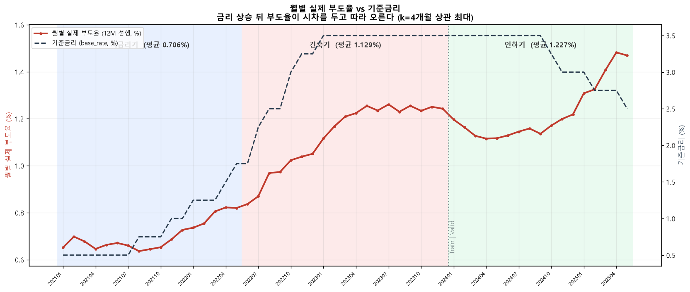
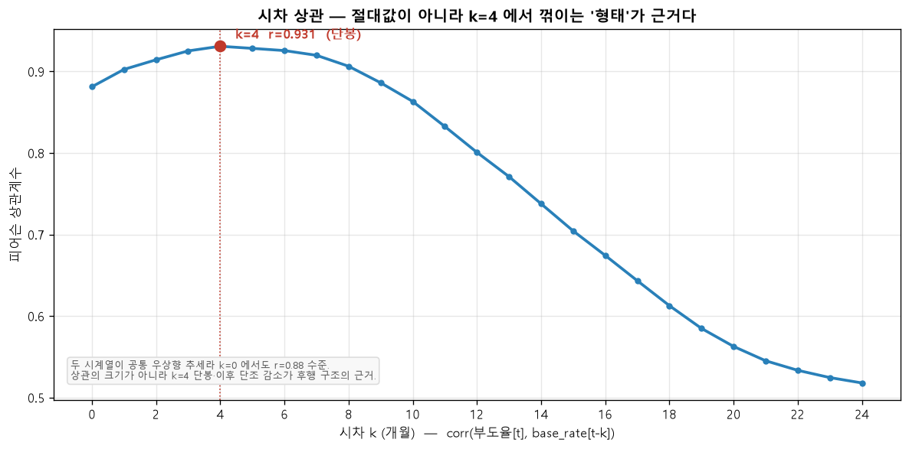

# 06. 비즈니스 임팩트

> **이 문서는 무엇을 다루는가**
>
> 모델이 실제 여신 심사·관리에서 어떤 값을 갖는지를 다룬다. AUC 같은 통계 지표
> 하나가 아니라 **현업의 의사결정 단위**로 환산한다 — 여신 포트폴리오의 상위
> 몇 퍼센트만 집중 관리하면 부도 기업의 얼마를 미리 잡는가, 재무제표만으로는
> 정상으로 보이는 기업을 잡아내는가, 오탐과 미탐의 비용 구조에서 어느 임계값이
> 최적인가.
>
> 수치는 **시점 정합성이 확인된 최종 모델(D8)** 로만 산출한다. 누수를 포함한 초기
> 모델의 지표는 이 문서에 쓰지 않는다. 앞세우는 숫자는 AUC 0.8578 이 아니라
> **상위 10% 집중 관리 시 부도 기업 76.0% 포착**과 **재무 양호군 부도 기업
> 82.6% 포착**이다 — 실무자가 바로 이해하는 단위다.

## 목차

1. 모형이 무엇을 하는가 — 상위 10%로 부도 기업 76.0% 포착
   1. 여신 포트폴리오 상위 X% 집중 관리 관점
   2. 보조 근거 — 긴축기 경보가 인하기 부도로 실현된다
2. 차별점 — 재무제표는 양호한데 부도한 기업
3. 등급 체계와 임계값
   1. 5등급(Z-Score)과 16단계 표기 등급
   2. 등급별 실제 부도율
   3. 확률 보정은 등급을 바꾸지 않는다
   4. 절대 PD 수준은 재보정 없이 쓸 수 없다
   5. 오탐·미탐 비용 비대칭과 임계값 선택
4. 거시 상호작용의 전달 구조 — 부호가 아니라 구조를 본다
5. 포털 적용 현황
6. 한계

## ★ 수치 기재 규칙

이 문서의 모든 수치에 **출처와 조건을 병기**한다.

> 예: `Valid 상위 10% 부도 기업 포착률 76.0% (421/554, 202401~202505, C1_venn_results.md §B)`

**구세대 수치를 쓰지 않는다.** 아래는 누수 포함 모델 또는 이전 세대 기준선의 값이며
이 문서에 등장해서는 안 된다.

| 쓰지 말 것 | 사유 |
|---|---|
| AUC 0.9005 | 누수 포함 모델 |
| AUC 0.9412 | 구 기준선(A0=0.7826) 기준의 누수 상한 (정본 A7 0.9398) |
| 리드타임 11.3개월 / 12.9개월 | 누수 포함 모델 기준 |
| 리드타임 6.8개월 | 구 README 기재값. 재산출 전까지 인용 금지 |
| 벤 다이어그램 63.4% / 36.6% | 구세대 산출. 정본은 `C1_venn_results.md` |

> ★ "내부 조기경보모형 대비 리드타임" 류의 **직접 비교 수치는 이 저장소의 데이터로
> 산출할 수 없다.** 내부 모형 부도율(`OBV_RZVL_POD`)이 202101~202111 (11개월)에만
> 존재하기 때문이다. 경위는 §6-1 과 07 문서 §4-12.

---

## 1. 모형이 무엇을 하는가 — 상위 10%로 부도 기업 76.0% 포착

### 1-1. 여신 포트폴리오 상위 X% 집중 관리 관점

심사역이 전체 차주를 같은 강도로 관리할 수는 없다. 현실적인 운영 모델은 **예측
부도확률(PD)이 높은 상위 X% 를 집중 관리 대상으로 지정**하는 것이다. D8 의 상위 X%
가 실제 부도 기업을 얼마나 담고 있는지를 **Valid 홀드아웃(202401~202505, 312,334행 /
양성 3,832행 / 부도 기업 554사 / 기준율 1.2269%)** 에서 측정했다. Valid 는 학습에
쓰지 않은 구간이므로 이 수치는 out-of-sample 이다.

| 집중 관리 범위 | 부도 **기업** 포착 | 부도 **행** 포착 | 행 기준 Lift |
|---|--:|--:|--:|
| 상위 10% | **76.0%** (421 / 554) | 57.5% (2,205 / 3,832) | 5.75 |
| 상위 20% | 88.4% (490 / 554) | 74.6% (2,859 / 3,832) | 3.73 |
| 상위 30% | 93.1% (516 / 554) | 84.0% (3,217 / 3,832) | 2.80 |

<sub>출처: `docs/appendix/audit/C1_venn_results.md` §B · 스크립트
`eda_pipeline/step43_venn_analysis.py` · 로그 `logs/C1_venn.log`. 원자료
`database/portal_v2.duckdb::corporate_panel` (D8 재채점, `PROB_FULL`=`PROB_RAW`).
"기업 포착" = 해당 구간에 **한 번이라도** 상위 X% 에 든 부도 기업.</sub>

- **여신 상위 10% 만 집중 관리해도 인하기에 부도한 기업의 약 4분의 3(76.0%)을 사전에
  포착**한다. 관리 범위를 30% 로 넓히면 93.1% 다.
- 행 기준 포착률(57.5%)이 기업 기준(76.0%)보다 낮은 것은 자연스럽다 — 한 기업이
  12개월 중 몇 달만 상위권에 들어도 그 기업은 "포착" 으로 센다. 조기경보의 목적이
  "부도 전 어느 시점엔가 경보를 냈는가" 이므로 **기업 기준이 운영에 맞는 지표**다.

> ★ 이 표의 상위 X% 는 **고정 확률 임계값이 아니라 "포트폴리오에서 가장 위험한
> X%"** 라는 운영 모델이다. 고정 임계값으로 이진 알람을 낼 때의 포착률·알람 물량은
> §3-5 에서 따로 다룬다(그 관점의 행 기준 재현율은 더 낮다).

### 1-2. 보조 근거 — 긴축기 경보가 인하기 부도로 실현된다

관측 시점이 학습 구간(긴축기, 202206~202312)이고 부도 발생이 홀드아웃(인하기,
202401~202505)이면 두 구간이 겹치지 않으므로 **시점 오염이 없다.** 긴축기에 D8
상위 X% 로 **한 번이라도** 경보가 났던 기업(A군)과 나머지(B군)의 **인하기 부도율**을
비교했다.

| 긴축기 경보 기준 | 경보 기업 A | 그중 인하기 부도 | A 부도율 | 비경보 B 부도율 | Lift(A/B) | 인하기 부도 기업(554) 중 포착 |
|---|--:|--:|--:|--:|--:|--:|
| 상위 10% | 3,248사 | **308사** | 9.48% | 1.33% | **7.15** | 55.6% |
| 상위 20% | 6,025사 | 381사 | 6.32% | 1.10% | 5.77 | 68.8% |
| 상위 30% | 8,338사 | 423사 | 5.07% | 0.97% | 5.21 | 76.4% |

<sub>출처: `C1_venn_results.md` §C. 인하기 부도 기업 554사는 인하기 관측 기업 기준.</sub>

이 결과는 **긴축 충격이 시차를 두고 부도로 실현된다**는 것과 정합한다. 월별 부도율과
기준금리의 시차 상관 `r(부도율[t], base_rate[t−k])` 은 **k=4개월에서 단봉(r=0.931)** 이고
동시점(k=0)의 0.881 보다 크다 (`step42_macro_regime.py` 산출).[^kcorr] 형태는 아래
두 그림에 있다.

[^kcorr]: C-1 벤 다이어그램 분석은 다소 다른 월 표본에서 같은 상관을 k=4 r=0.918 로
재현했다(`C1_venn_results.md` §C). 표본이 다를 뿐 둘 다 k=4 단봉이다. **본문 정본은
`step42/A3` 의 r=0.931 로 통일한다.**





<sub>산출: `eda_pipeline/step45_regime_plots.py` · 원자료
`docs/appendix/audit/A3_macro_regime.json`. 왼쪽 그림 배경색 = 저금리기/긴축기/인하기,
우축 점선 = 기준금리. 오른쪽 그림은 절대값이 아니라 **k=4 단봉·이후 단조 감소** 형태가
후행 구조의 근거다.</sub>

> ★ **유보 세 가지 (반드시 함께 읽는다).**
> 1. 부도율은 2024년에 한 번 반락한다(월별 최저 202404 1.115%). 단조 후행이 아니라
>    '긴축 고점 유지 중 정체·소폭 반락 → 인하 국면 재점화' 의 **2단 패턴**이다.
> 2. 부도율·기준금리 두 시계열이 관측창 안에서 공통 우상향 추세라 상관계수의 **절대
>    수준은 부풀려져 있다**(k=0 에서도 r≈0.88). 근거로 쓸 수 있는 것은 크기가 아니라
>    lag 곡선이 **k=4 에서 꺾이는 형태**와 구간별 순서다.
> 3. 인하기 구간(202401~202505)은 VALID 홀드아웃과 정확히 겹친다. 국면 효과와 표본
>    시기 효과가 분리되지 않으므로 이 표는 **관측 사실로만** 인용하고 모델 성능
>    변화의 원인으로 돌리지 않는다.

---

## 2. 차별점 — 재무제표는 양호한데 부도한 기업

**재무제표만으로는 정상으로 보이는데 부도하는 기업**을 D8 이 잡는지 본다.
"재무 양호" 는 NICE CRI 등급 서열 `C302_CRI_ORD` 가 상위 50%(값 ≤ 중앙값 13.0)인
행으로 정의한다. 등급 이력이 없는 행(결측률 22.89%)은 판정 불가로 제외한다.

| 구간 | 재무 양호 + 부도 기업 | D8 상위 10% 포착 | 상위 20% | 상위 30% |
|---|--:|--:|--:|--:|
| **전 구간** (202101~202505, 388,343행) | 115사 | **95사 (82.6%)** | 106사 (92.2%) | 107사 (93.0%) |
| Valid 단독 (202401~202505, 133,783행) | 64사 | 40사 (62.5%) | 50사 (78.1%) | 53사 (82.8%) |

<sub>출처: `C1_venn_results.md` §D. 양호군 부도율은 전 구간 0.1161% / Valid 0.1405%
로 전체 기준율의 10분의 1 수준이다(그래서 "양호" 로 부른다).</sub>

**내부 조기경보모형은 재무 지표를 중심으로 만들어지므로, 재무제표상 양호한 기업은
구조적으로 포착이 어렵다.** 본 모형은 이 그룹의 **82.6%(전 구간, 95/115)** 를 상위
10% 안에 포착했다.

> ★ **다만 내부 모형과의 직접 대조는 데이터 한계로 수행하지 못했으므로 이것은 간접
> 증거다.** 내부 모형 부도율(`OBV_RZVL_POD`)이 202101~202111 (11개월, 전부 저금리기·
> 전부 학습 구간)에만 존재해 비교 가능한 조건이 성립하지 않는다(§6-1, 07 §4-12).
> "내부 모형이 이 그룹의 몇 %를 놓쳤다" 같은 수치는 만들지 않았다.

---

## 3. 등급 체계와 임계값

### 3-1. 5등급(Z-Score)과 16단계 표기 등급

모델이 내놓는 것은 0~1 사이 부도확률 한 개다. 현업 단위는 등급이므로 변환한다.
**변환은 확률을 직접 자르지 않고 로그오즈를 표준화한 Z-Score 를 자른다.**

```
LOG_ODDS = ln( PD / (1 − PD) )
Z_SCORE  = (LOG_ODDS − mu) / sigma          mu = −4.2433,  sigma = 2.8871
```

| 등급 | Z-Score 구간 | 대응 PD 구간 | 성격 |
|---|---|---|---|
| **G1** | Z ≤ −1.0 | PD ≤ 0.080% | 정상 |
| **G2** | −1.0 < Z ≤ 0.0 | 0.080% < PD ≤ 1.413% | 정상 |
| **G3** | 0.0 < Z ≤ +1.0 | 1.413% < PD ≤ 20.481% | 주의요망 |
| **G4** | +1.0 < Z ≤ +2.0 | 20.481% < PD ≤ 82.216% | 고위험 |
| **G5** | Z > +2.0 | PD > 82.216% | 부실우려 |

<sub>`mu`/`sigma` 는 **Valid 홀드아웃(202401~202505, 312,334행) 로그오즈의 평균/표준편차**
다 (`eda_pipeline/output/grade_mapping_v2.json` · 산출 `step40_grade_threshold.py`).
전 구간 분포로 표준화하면 홀드아웃 밖 정보가 컷오프에 들어가므로 Valid 로 고정했다.
컷오프 `[−1, 0, +1, +2]` 는 등폭 Z 이며 데이터를 보고 조정하지 않았다
(`z_cutoffs_adjusted = false`).</sub>

**왜 확률을 직접 자르지 않는가.** 부도확률은 0 근처에 극단적으로 몰려 있어(전 구간
기저율 1.0350%) 확률 등분할은 하위 등급을 사실상 구분하지 못한다. 로그오즈는 이
왜곡을 펴 주므로 등폭 컷오프가 의미를 갖는다.

포털은 등급을 두 가지로 보여 준다 — **5단계 리스크 등급(G1~G5, Z-Score 기준)** 과
**16단계 표기 등급(AAA~CCC, raw PD 분위 기준, 기존 CB 등급과 눈높이 맞춤)**. 두 체계는
목적이 다르고 서로 어긋나지 않는다: 16단계 경계를 같은 축으로 환산하면 5단계 경계
사이에 정확히 끼어들고, 전수 교차표에서 어떤 16단계 밴드도 비인접 5단계 등급을 걸치지
않는다. **리스크 판정 근거로는 5단계만 쓴다** (16단계는 표기용이다. Valid 기준으로는 16단계
부도율도 단조 확보이나, 전 구간 집계에서는 인접 밴드 1쌍이 표본 노이즈로 역전될 수
있다). 상세와 전수 검증은 03 문서 등급 절 · `docs/appendix/audit/B1_grade_basis.md`.

### 3-2. 등급별 실제 부도율

**Valid 홀드아웃 (202401~202505, 312,334행, 기저율 1.2254%)** — 성능을 말할 때의 정본

| 등급 | 관측치 | 부도건수 | 부도율% | Lift |
|---|--:|--:|--:|--:|
| G1 | 52,431 | 33 | 0.0629 | 0.05 |
| G2 | 98,074 | 197 | 0.2009 | 0.16 |
| G3 | 109,863 | 911 | 0.8292 | 0.68 |
| G4 | 48,381 | 1,982 | 4.0966 | 3.34 |
| **G5** | 3,585 | 709 | **19.7768** | **16.12** |

<sub>출처: `grade_mapping_v2.json` `grade_table` · DB 재현 검증 `B1_grade_basis.md` §4.</sub>

**단조성 확보** — 등급이 한 단계 나빠질 때마다 부도율이 예외 없이 올라간다. **G5 는
전체 대비 16.12배**, 상위 1.15%(3,585 / 312,334)에 부도 709건이 몰려 있다.

> ★ 전 구간(948,214행) 집계로는 G5 부도율이 **45.21%** 로 다르게 나온다. 모델이
> 달라진 것이 아니라 **집계 모집단이 다르다** — Train/Dev(< 202301) 기저율 0.7876%
> vs Valid(≥ 202301) 1.2254%. **홀드아웃 성능을 주장하는 자리에서는 Valid 값
> (19.78%)만 쓴다.** 전 구간 값은 포털 화면 분포를 설명할 때만, 구간을 병기해 쓴다.

### 3-3. 확률 보정은 등급을 바꾸지 않는다

이 모델은 표시 목적에 따라 네 가지 확률을 산출한다 — `raw`, `prior`, `platt_train`,
`platt_dev`. **어느 것을 쓰더라도 등급·경보 대상·AUC·Lift 는 바뀌지 않는다.** Platt
보정 `σ(a·logit(p) + b)` 와 Z-Score 표준화가 모두 순증가 함수라 개체별 순위가
보존되기 때문이다. `corporate_panel` **전수 948,214행**(샘플 아님)에서 확인했다 —
`Z_SCORE` vs `PROB_RAW`, `Z_SCORE` vs `LOG_ODDS`, `PROB_RAW` vs `PROB_PLATT_TRAIN`,
`PROB_RAW` vs `PROB_PLATT_DEV` 순위 불일치 **각 0건** (`B1_grade_basis.md` §2).
보정 방식 선택은 **화면에 표시하는 PD 값**만 바꾼다.

### 3-4. 절대 PD 수준은 재보정 없이 쓸 수 없다

예측 PD 10분위별 실제 부도율 (D6m, `platt_train`, 시드 10회 평균 —
`stage7_report_inputs/calibration_compare_D6m.json`)

| 분위 | 예측 평균 PD% | 실제 부도율% | 격차%p |
|---:|---:|---:|---:|
| 1 | 0.0000 | 0.0371 | +0.0371 |
| 2~6 | 0.0000 | 0.1057 → 0.4847 | +0.11 ~ +0.48 |
| 7 | 0.0002 | 0.7591 | +0.7590 |
| 8 | 0.0012 | 1.1459 | +1.1447 |
| 9 | 0.0152 | 1.9956 | +1.9805 |
| **10** | **4.3111** | **6.8198** | **+2.5087** |

- **분위별 실제 부도율이 완전히 단조 증가하고 최상위/최하위가 183.6배**다. 등급
  서열은 신뢰할 수 있다.
- 그런데 **하위 6분위의 예측 PD 가 0.0000%** 다 — 구조적 과소추정이다. 원인은 구간
  기저율 차이(Train 0.9116% / Dev 1.2424% / Valid 1.2269%)다.

| 보정 | 평균 PD% | 실제 대비 | 0 으로 보이는 분위 | 월별 MAPE% |
|---|---:|---:|---:|---:|
| `raw` | 8.8336 | 7.20배 | 0 | 626.17 |
| `prior` | 0.2235 | 0.18배 | 1 | 81.63 |
| `platt_train` | 0.4328 | 0.35배 | 6 | 64.43 |
| **`platt_dev`** | **1.0632** | **0.87배** | 2 | **12.72** |

적합 구간만 Train → Dev 로 바꾸니 평균 PD 가 실제에 근접하고 월별 MAPE 가 **5배**
개선된다. `prior`(가중 역보정)는 **가장 나빴다** — R2 규제가 이미 확률을 눌러 놓았는데
`ln(spw)=4.6886` 을 또 빼서 과보정된다.

| 용도 | 보정 | 근거 |
|---|---|---|
| 모델 비교·판정 | `platt_train` | 홀드아웃 오염 없음 |
| **포털 표시 PD** | **`raw`(`PROB_FULL`) — 현재 구현.** 방침(§ 아래)은 `platt_dev` | 운영에서는 "예측 직전 구간 재보정" 이 정상 절차 |
| Z-Score 등급 | **무관** | 등급은 로그오즈 기준, 보정은 단조 변환 |

> ★ `step36_final_config.md` §6 은 "포털 표시 PD = `platt_dev`" 를 방침으로 적었으나,
> **실제 포털은 `PROB_FULL`(raw) 을 표시한다** (`PROB_DISPLAY`=`platt_dev` 컬럼은 DB 에
> 있으나 참조하는 코드가 0곳). "raw 기준 확정" 이 이미 승인되어 현재 구현이 정본이고,
> 방침 문구와의 차이만 기록한다 (`B1_grade_basis.md` §5 #5).

### 3-5. 오탐·미탐 비용 비대칭과 임계값 선택

집중 관리(§1) 대신 **고정 확률 임계값으로 이진 알람**을 낼 때의 표다. 미탐(부도를
놓침)이 오탐(정상을 경보)보다 훨씬 비싸므로, 비용비를 정해 총비용을 최소화하는
임계값을 구했다. **Valid 202401~202505, 312,334행 / 양성 3,832행 / 기준율 1.2269%**
기준 (`eda_pipeline/output/threshold_v2.json` · 산출 `step40_grade_threshold.py`).

| 기준 | 임계값(raw PD) | 알람 물량(행) | 알람률% | 포착(행 재현율) | 정밀도 |
|---|--:|--:|--:|--:|--:|
| F2 최적 | 0.6443 | 11,357 | 3.64 | 37.1% (1,423 / 3,832) | 12.5% |
| 비용비 5:1 | 0.9056 | 1,203 | 0.39 | 8.7% | 27.7% |
| 비용비 10:1 | 0.6694 | 10,029 | 3.21 | 34.7% | 13.3% |
| 비용비 20:1 | 0.5634 | 16,044 | 5.14 | 43.2% | 10.3% |

- 이 표의 재현율(37~43%)은 **행 단위**이고 **단일 임계값** 기준이라 §1 의 기업 단위
  집중 관리 포착률(76.0%)보다 낮다. 두 수치는 다른 운영 모델을 잰 것이다 — 임계값은
  "이 달에 알람을 낼 것인가", 집중 관리는 "이 기업을 관리 대상에 넣을 것인가".
- **비용비 10:1 이면 알람 물량이 월평균 약 590건(10,029 / 17개월)** 이고 행 재현율
  34.7%, 정밀도 13.3% 다. 운영 부하와 포착의 균형점은 조직이 비용비를 정하는 데
  달려 있다.
- 임계값은 raw 확률 기준이다. 확률 보정을 적용하면 임계값도 같은 단조 변환을 거치며
  **포착·알람 건수는 동일**하다.

---

## 4. 거시 상호작용의 전달 구조 — 부호가 아니라 구조를 본다

D8 은 거시 원본을 직접 넣지 않고 **거시 충격 × 기업 노출도** 상호작용항 14개로 넣는다
(05 문서 §7). 포털의 `apply_macro_shock` 이 흔드는 원시 거시 컬럼은 서빙 모델
(`lgbm_v2_lean_macro.txt`, 59피처)에 하나도 없어(모델은 원시 거시가 아니라 `ix_*`
상호작용항만 사용) 재사용할 수 없어(§5, `A4_portal_status.md`), **D8 상호작용항을
직접 재계산하는 독립 스크립트**(`eda_pipeline/step44_macro_stress_d8.py`)로 충격 전/후
평균 PD 를 비교했다. 대상은 Valid 312,334행, raw PD.

| 시나리오 | 재계산 항 | 평균 PD 변화 | Δ(%p) | 차입금의존도 상위 25% Δ(%p) |
|---|---|--:|--:|--:|
| S1 신용스프레드 +100bp | (없음) | — | **0.0000** | — |
| S2 KORIBOR 스프레드 +50bp | `ix_KORIBOR_spread_d12__liq` | 10.42% → 8.68% | −1.7413 | −2.4685 |
| S3 제조업 내수 BSI −10p(yoy) | `ix_BSI_mfg_domestic__mfg` | 10.4235% → 10.4257% | +0.0022 | +0.0033 |
| S4 수출물량 −10%p(yoy) | `ix_export_index__mfg` | 10.4235% → 10.4443% | **+0.0208** | +0.0299 |
| S5 미분양 +20%p(yoy) | `ix_unsold_housing__mfg` | 10.4235% → 10.4282% | +0.0047 | +0.0072 |

<sub>출처: `docs/appendix/audit/C1_macro_stress_results.md`. raw PD 는
`scale_pos_weight` 팽창분을 포함하므로 절대 수준이 아니라 **충격 전/후 변화**를 본다.</sub>

**S1 — 신용스프레드 채널은 아예 없다.** D8 에 신용스프레드를 재료로 하는 피처가 하나도
없다. D6 의 `credit_spread_x_lev` 는 4구간 부호 검사(Train 전반/후반/전체/Valid)에서
부호가 일치하지 않아(Train 전체 −0.796 / Valid +0.785 완전 반전) **최종 모형에서
제외**했다. 상관이 존재해도 방향이 구간마다 바뀌는 변수는 스트레스 시나리오에 쓸 수
없다. 따라서 S1 의 효과는 0 이며, **이는 모형 결함이 아니라 검증 기준을 통과하지
못한 변수를 의도적으로 넣지 않은 결과**다.

**S2 — KORIBOR 스프레드는 부호가 이론과 반대다.** 스프레드 확대(+50bp)에 평균 PD 가
**내려간다.** 관측 53개월에 금리 사이클이 한 번뿐이라, `NEW_KORIBOR_spread_diff12` 가
높았던 2022~23 긴축기에 부도율이 아직 낮았고 스프레드가 음(−)으로 돌아선 2024~25
인하기에 부도가 몰렸기 때문이다(05 문서 §5 의 '금리 계열 부호 반전'과 같은 현상).
이 항의 단조 제약을 **0(방향 미지정)** 으로 둔 이유가 이것이다 — KORIBOR−기준금리는
자금경색과 금리인상 기대를 함께 반영해 경제적 해석이 양방향이다.

> **부호는 언급하되 해석하지 않는다.** 부호는 단일 금리 사이클 표본의 한계로 경제
> 이론과 반대로 나타난다(05 §5). 따라서 S2 는 **충격의 방향이 아니라 전달 구조를
> 보여주는 것으로만** 해석해야 하며, 현 시점에서 스트레스 시나리오 수치로 사용할 수
> 없다.

**S2·S1 이 실제로 보여주는 것은 두 가지뿐이다.**

1. **노출도 상호작용이 기계적으로 작동한다.** 거시 충격이 전 기업에 동일하게 적용되지
   않고 기업별 노출도에 따라 다르게 전달된다 — STAGE 5 설계의 목적이었고 실제로
   작동함을 확인했다.
2. **반응 크기가 레버리지에 비례한다.** 차입금의존도(`exp_rate`) 상위 25% 의 변화폭
   (S2 −2.47%p)이 전체(−1.74%p)보다 크다. "차입이 많은 기업이 금리 충격에 더 크게
   반응한다" 는 구조가 재현된다.

**S3~S5 — 부호가 방어 가능한 시나리오.** 단조 제약(+1/−1)이 걸린 항은 부호가
강제되므로 시뮬 방향이 경제 이론과 일치한다. 업황 BSI 가 나빠지거나(S3, 제약 −1),
수출이 부진하거나(S4, 제약 −1), 미분양이 늘면(S5, 제약 +1) **제조업 차주 PD 가
상승**하고, 세 경우 모두 차입 의존도 상위군의 반응이 더 크다. 방향은 방어 가능하나
**변화 폭은 작다**(각 +0.002 ~ +0.021%p) — 이 세 항의 gain 기여가 미미하기 때문이다
(각 0.02~0.03%, `step36_final_config.md` §4). 발표에서 스트레스 시나리오를 제시해야
한다면 **S4(수출 −10%p → 포트폴리오 PD +0.021%p, 고레버리지 +0.030%p)** 가 부호와
크기 모두 방어 가능한 예다.

> **한계**: 이 시뮬레이션은 백테스트로 검증되지 않았다. 거시 충격을 전 기간 평행
> 이동으로 가했고(실제 스프레드 동학·2차 효과 미반영) raw PD 를 썼다. IFRS9 스트레스
> 테스트가 정확히 이 방식이며, **민감도의 방향·크기가 기업별로 어떻게 분포하는지를
> 보여주는 예시일 뿐 예측 성능의 근거가 아니다.**

---

## 5. 포털 적용 현황

포털(FastAPI + React)은 세 화면을 제공한다. **현행 구현과 D8 의 연동 상태를 있는
그대로 적는다** (조사: `docs/appendix/A4_portal_status.md`, 2026-09-03).

### 5-1. 포털이 쓰는 모델 — Lean_macro (숨기지 않고 차이를 적는다)

포털 서빙은 **`lgbm_v2_lean_macro.txt` (59피처, Valid AUC 0.8541, σ 0.0030)** 를
쓴다. Full D8 (164피처, 0.8578) 대비 **−0.0037** 이다. σ 가 0.0030 으로 커서
Full 과의 차이가 노이즈대(0.003)와 겹치는 구간이지만, 그대로 밝힌다. Lean_macro
를 택한 이유는 두 가지다 — **응답 속도**(피처 59개 vs 164개)와 **거시 상호작용
14개를 전부 유지**해 포털의 거시 시뮬레이션 확장 여지를 남기는 것. 순수 gain 컷
Lean(46피처, 0.8531)은 거시 항이 1개만 남아 포털에는 부적합하다. 등급·임계값은
Full D8 기준으로 산출한 `grade_mapping_v2.json` / `threshold_v2.json` 을 공유한다.

| 화면 | 상태 | 비고 |
|---|---|---|
| 차주 상세 — 개별 리스크 설명(SHAP) | **동작 확인됨** | B-2 에서 `MODEL_PATH` 를 `lgbm_v2_lean_macro.txt`(59피처, Valid AUC 0.8541)로 교체하고 `uvicorn` 실기동, `GET /api/borrowers/{bzno}/shap` · `GET /api/borrowers/{bzno}` 를 실제 V_BZNO 3건으로 호출해 전부 200 확인 (`logs/B2_shap_lean_macro.log`) |
| 글로벌 대시보드 | **부분** | 등급 분포·예측 벤 다이어그램은 동작. **"업종별 리스크 매트릭스" 는 프론트에서 제거됨**(커밋 `10a0f2c`, X축 버그). 백엔드 `top_risk_industries` 집계는 남아 있으나 화면이 호출하지 않아 사문화 (07 §4-8) |
| 거시 시뮬레이션 | **D8 미연동** | `model_inference.py` 는 최종 서빙 모델(`lgbm_v2_lean_macro.txt`, 59피처)을 로드한다(2026-09-03 교체). 그러나 시뮬레이션은 동작하지 않는다 — ① `apply_macro_shock` 이 흔드는 원시 거시 컬럼(금리·환율·유가 등) 84개가 59피처 안에 하나도 없다(모델은 원시 거시 대신 상호작용항 `ix_*` 14개만 사용해 교집합 **0**). ② `simulation` 라우터가 레거시 컬럼 `STD_INDS_CFC` 를 참조하는데 현재 모델은 `STD_INDS_SECTION` 을 써서 `KeyError` 로 500 을 반환한다(실측, `C1_macro_stress_results.md` 상단). `dashboard`·`monitoring` 라우터는 별도 검증 전 |

- **매크로 시뮬레이션은 D8 기준으로 무효다.** §4 의 스트레스 산출은 포털이 아니라
  **독립 스크립트**(`step44_macro_stress_d8.py`)로 낸 것이다. 포털에 D8 거시
  시뮬레이션을 붙이려면 DB 에서 원시 거시 컬럼을 읽어 `apply_macro_shock` 대상에
  포함시키거나 상호작용항을 직접 흔들도록 재설계하고, `simulation` 라우터의
  `STD_INDS_CFC` 참조를 `STD_INDS_SECTION` 으로 고쳐야 한다 — **향후 과제**다.
- PSI 모니터링 중 `pd_distribution`·`drift`·`borrowers` 엔드포인트는 DB 의
  `PROB_FULL`(이미 D8/lean_macro 기준으로 재채점됨)을 직접 써서 최신 상태다. 다만
  `metrics` 엔드포인트가 표시하는 Total PSI 등은 별도 정적 스냅샷
  `step13_performance_metrics.txt`(구 모델 기준, 07 문서 과제 7번)에서 읽어 D8 기준으로
  갱신되지 않았다 — `PROB_FULL` 자체가 아니라 이 스냅샷 파일만의 문제다.

---

## 6. 한계

### 6-1. 내부 조기경보모형과의 직접 대조를 하지 못했다

이 문서의 §1·§2 는 **D8 단독 포착률**이다. 원래는 내부 조기경보모형(EWS)의 부도율
`OBV_RZVL_POD` 와 교차해 "내부 모형이 놓친 부도를 D8 이 잡았다" 를 벤 다이어그램으로
보이려 했으나 수행하지 못했다.

> 내부 조기경보모형과의 AUROC·리드타임 비교는 수행하지 못했다. `RZVL_POD` 가
> 202101~202111 11개월에만 존재하고 202112 이후 전 행 0 이며, 그 11개월이 전부
> 저금리기·Train 구간이다. 비교 가능한 조건이 성립하지 않으므로 **수치를 산출하지
> 않았다.** README 에 기재되어 있던 '내부 모형 AUROC 0.77 대비' 주장은 근거를 확인할
> 수 없어 폐기한다. 준비 스크립트의 `budo_pod_coverage = 1.0` 은 결측을 채운 0 을
> "값 있음" 으로 센 오탐이었다. 상세: 07 문서 §4-12.

→ **"내부 모형 대비 리드타임 N개월", "내부 모형이 X% 를 놓쳤다" 류의 직접 비교
주장은 이 저장소의 데이터로 뒷받침되지 않는다.** in-sample·단일 국면 AUROC 를 산출해
각주로 다는 방식도 채택하지 않았다 — 표에 숫자 두 개가 나란히 있으면 각주와 무관하게
비교로 읽히기 때문이다. §2 는 간접 증거로만 서술했다.

### 6-2. 가상 사업자번호 데이터라는 성질

패널의 `V_BZNO` 는 실제 사업자번호가 아니라 대회용으로 생성된 가상 식별자다. 기업
단위 집계(부도 기업 수, 포착률)는 이 식별자에 의존하므로, 실데이터에서 동일 절차를
재현했을 때 값이 그대로 나온다는 보장은 없다. 절대 수치보다 **구조와 방향**(상위
X% 포착률의 단조성, 레버리지 비례 반응)을 근거로 읽어야 한다.

### 6-3. 실제 운영 전 필요한 추가 검증

- **캘리브레이션 재적합 절차 확정** — 포털 표시 PD 를 `raw` 로 둘지 운영 직전 구간
  재적합(`platt_dev` 계열)으로 갈지 방침을 확정하고 자동화해야 한다(§3-4).
- **임계값의 비용비 확정** — 5:1 / 10:1 / 20:1 중 어느 것을 쓸지는 조직이 미탐/오탐
  비용을 정해야 결정된다(§3-5).
- **D8 포털 연동** — 거시 시뮬레이션·PSI 모니터링을 D8 기준으로 재구성(§5).
- **다중 금리 사이클 데이터로 거시 채널 재검증** — 현재 거시 상호작용의 부호는 단일
  사이클에 묶여 있다(05 §5, §7). 최소 2개 사이클을 덮는 기간으로 확장해야 방향을
  주장할 수 있다.

---

## 상태

**본문 작성 완료 (D-1).** §1~§6 을 C-1 벤 다이어그램 산출(`C1_venn_results.md` ·
`C1_macro_stress_results.md`)과 B-1 등급 검증(`B1_grade_basis.md`), A-4 포털 조사
(`A4_portal_status.md`) 결과로 채웠다.

- 리드타임·사각지대의 **내부 모형 직접 대조는 데이터 한계로 수행 불가** — §6-1 · 07
  §4-12 에 기록하고, §2 는 간접 증거로 서술했다.
- 매크로 시뮬레이션은 포털이 아니라 독립 스크립트 산출이며 D8 거시 채널의 부호
  한계를 §4 에 명시했다. "스트레스 시나리오 수치" 로 쓸 수 있는 것은 S3~S5(단조
  제약 항)뿐이고 변화 폭은 작다.
- 구세대 수치(0.9005 / 0.9412 / 리드타임 11.3·12.9·6.8개월 / 63.4%·36.6%)는 "수치
  기재 규칙" 표에 인용 금지로 명시했다 (07 §0 에도 복제).
