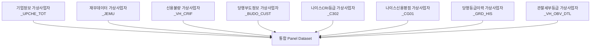

# [Phase 1] 데이터 수집, 통합 및 탐색적 데이터 분석 (Step 01 ~ 06)

본 보고서는 중소기업(SME) 거시-재무 연계 ERM 신용위험 모형 구축의 첫 번째 단계인 **데이터 수집, 파이프라인 구축, 통합 전처리 및 탐색적 데이터 분석(EDA)** 과정에 대한 요약 보고서입니다. 발표 및 PT 자료 제작 시 장표 구성의 기초 자료로 활용할 수 있도록 비즈니스 목적과 시각화 위주로 작성되었습니다.

---

## 📌 1. 데이터 수집 및 초기 검증 (Step 01 & 02)

### 1.1 비즈니스 목적 및 필요성
신용 리스크를 정밀하게 예측하기 위해서는 단순 재무 정보뿐만 아니라 **기업 개요, 신용 등급 이력, 실제 부도 발생 여부, 관찰 등급 추이** 등 다양한 관점의 원천 데이터 결합이 필수적입니다. 

### 1.2 통합 데이터 모델 (Data Integration)
사업자등록번호(`V_BZNO`) 및 기준년월(`BASE_YM`)을 기준으로 총 11종의 가상 기업 데이터를 통합하여 단일 Panel Dataset을 구축하였습니다.



---

## 📊 2. 탐색적 데이터 분석 (Step 03)

수집된 데이터의 품질을 검증하고, 모형의 편향을 방지하기 위해 기초 통계량 분석 및 시각화를 수행하였습니다.

### 2.1 결측치 분석 (Missing Rate Analysis)
모형 학습 전 변수별 결측 비율을 시각화하여, 대체(Imputation) 전략을 수립하였습니다. 재무제표가 누락된 영세 기업이나 특정 월에 누락된 비재무 변수들을 파악하였습니다.


### 2.2 부도 차주 트렌드 및 타겟 상관관계
시간 경과에 따른 전체 차주 수와 부도 차주 비율의 시계열 추이를 분석하여, 특정 시점(예: 경기 침체기)의 데이터 스큐 현상을 확인하였습니다.


---

## 📑 3. 차주별 종합 명세서 구축 (Step 04)

### 3.1 개념 설명 (Borrower Sheet)
개별 차주(`V_BZNO`) 관점에서 시계열 흐름에 따른 신용 상태의 누적 변화를 한눈에 모니터링할 수 있도록 **차주 원장(Borrower Sheet)**을 생성하였습니다.
* **비즈니스 가치**: 특정 기업의 재무 악화 흐름과 평점 하락, 최종 부도에 이르는 전 과정을 히스토리컬하게 추적 가능하여 심사역 발표 시 개별 사례(Case Study)로 활용하기 적합합니다.

---

## ⏳ 4. 12개월 부도 정의 및 패널 구성 (Step 05)

### 4.1 12개월 forward-looking 관찰 윈도우 (Time-to-Default)
신용 모형의 표준 가이드라인(바젤 기준 등)에 부합하도록, 특정 관찰 시점(`BASE_YM`)으로부터 **향후 12개월 이내에 부도가 발생할 확률**을 예측 타겟(`y = 1`)으로 정의하였습니다.

```
[관찰시점 t] --------------------> [t + 12개월 이내 부도 발생 여부 검증]
  (재무/재무/거시 지표 입력)            (Target y = 1 or 0 결정)
```

* **TTD (Time to Default) 분석 결과**: 부도가 발생한 기업들의 리드 타임을 분석하여 12개월 윈도우 설정의 비즈니스 타당성을 검증하였습니다.


---

## 📈 5. 거시경제 지표 연동 (Step 06)

### 5.1 거시-재무 연계의 필요성
중소기업의 부도 리스크는 개별 기업의 재무 상태뿐만 아니라 **금리 인상, 원달러 환율 급등, 경기 하강** 등 거시경제 환경의 외생적 충격에 매우 민감합니다. 
이를 반영하기 위해 한국은행 기준금리, 환율, 소비자물가지수(CPI), 산업생산지수 등의 거시 경제 시계열 데이터를 패널에 시점 매핑하여 결합하였습니다.

* **연동 대상 지표**: 기준금리(Base Rate), 환율(USD/KRW), 산업생산지수(IP), 소비자물가지수(CPI), GDP 성장률 추이 등.
* **기대 효과**: 경기 시나리오별 스트레스 테스트(Stress Test)가 가능한 다이내믹 시뮬레이션 기반을 마련하였습니다.
