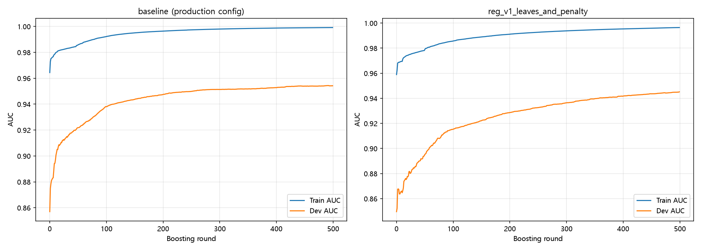
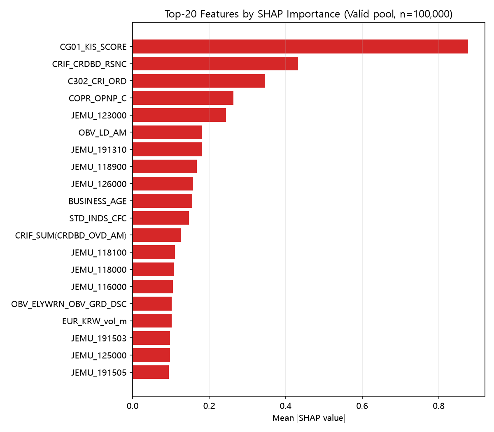
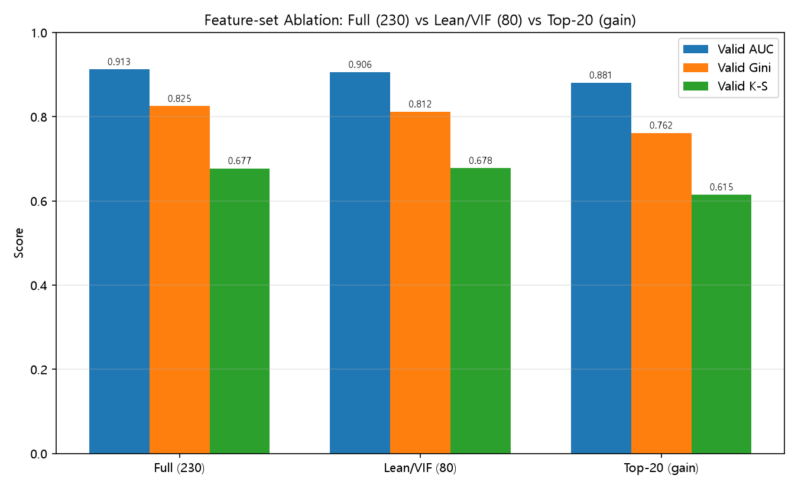
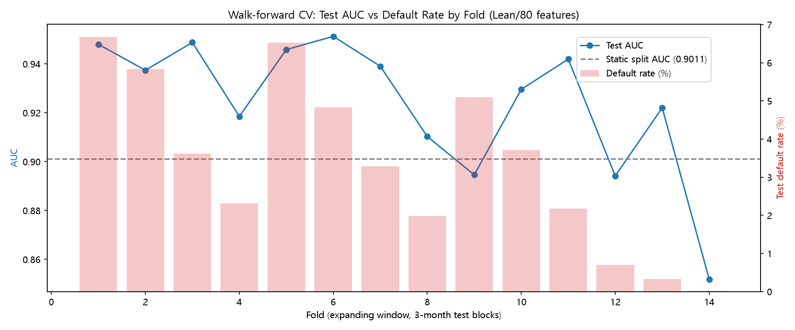
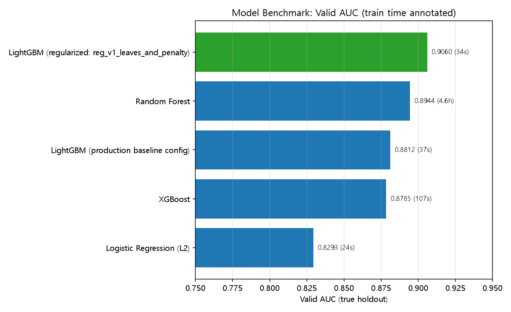

# [Step 28] 모델링 검증 (교수님 피드백 대응) — 과적합·SHAP 정제·변수축소·워크포워드 CV·타 모델 비교

> **작성일**: 2026-07-03
> **배경**: 교수님 피드백으로 현재 LightGBM 부도예측 모델(`eda_pipeline/output/lgbm_12m_model.txt`, Full 230개 변수 / `lgbm_12m_lean_model.txt`, Lean 80개 변수)에 대해 5가지 검증 요청 — ① 학습 파라미터 과적합 우려, ② SHAP 상위 변수 "샤프닝(정제)" 필요 여부, ③ 상위 20개 변수 축소 시 성능, ④ 시계열 데이터 특성을 반영한 크로스밸리데이션/워크포워드 CV, ⑤ 다른 모델과의 비교.
>
> **범위**: 이번 라운드는 **진단·리포트만** 수행한다. 아래에서 더 나은 설정이 확인되더라도 운영 모델 파일(`lgbm_12m_model.txt`/`lgbm_12m_lean_model.txt`)은 교체하지 않으며, 채택 여부는 이 리포트를 검토한 뒤 별도로 결정한다.

---

## 0. 검증 방법론

### 0.1 데이터 소스
원본 학습 CSV(`eda_pipeline/output/nh_panel_macro_12m.csv`, 6.76GB)는 이 체크아웃에 존재하지 않고(다운로드 폴더에만 있음), 이 머신의 여유 메모리가 약 4GB로 빠듯하다. 대신 **`database/portal.duckdb`의 `corporate_panel` 테이블**(1,944,418행 × 240컬럼)이 운영 모델을 만든 것과 **정확히 동일한 모집단과 TRAIN/VALID 경계**(TRAIN 2021.01~2023.12, VALID 2024.01~2026.06)를 담고 있어, DuckDB로 필요한 컬럼만 push-down해서 읽는 방식으로 재현했다. 공용 유틸은 `eda_pipeline/validation_common.py`에 있다.

### 0.2 중요 방법론 이슈: Valid 오염 → Train/Dev/Valid 3-way 분리로 교정
기존 학습 스크립트(`eda_pipeline/step7_modeling_shap.py`)는 `LGBMClassifier(n_estimators=300, learning_rate=0.05, max_depth=8, class_weight='balanced')`만 지정하고 `num_leaves`(기본 31)/`reg_alpha`/`reg_lambda`(기본 0)/`subsample`·`colsample_bytree`(기본 1.0)는 전부 기본값이며, **early stopping을 최종 성능 보고에 쓰는 것과 동일한 Valid 셋에 대해 수행**한다 — Valid가 완전한 홀드아웃이 아니라는 뜻이다.

이번 검증에서는 TRAIN의 마지막 3개월(202310~202312)을 별도 **Dev** 슬라이스로 떼어 early stopping에만 쓰고, **VALID(2024.01~2026.06)는 모든 실험에서 최종 채점 1회에만 사용**하는 구조로 재설계했다(`three_way_split()`). 아래 모든 결과는 이 방식으로 산출된, 편향이 제거된 수치다.

---

## 1. 과적합 진단 (항목 1)

`eda_pipeline/step14_overfit_diagnostics.py` — Full(230개 변수) 기준.

| 구성 | best_iter | Train AUC | Dev AUC | **Valid AUC (진짜 홀드아웃)** | Valid Gini | Valid K-S | 과적합 격차(Train−Valid) | 학습시간(s) |
|---|---:|---:|---:|---:|---:|---:|---:|---:|
| baseline (운영 설정 그대로) | 493 | 0.99914 | 0.95435 | 0.89054 | 0.78107 | 0.65233 | **0.10860** | 176.3 |
| **reg_v1 (num_leaves=15, min_child_samples=100, reg_alpha/lambda=1.0)** | 500 | 0.99644 | 0.94516 | **0.91255** | 0.82510 | 0.67745 | **0.08389** | 145.7 |
| reg_v2 (feature/bagging_fraction=0.7, bagging_freq=5) | 467 | 0.99903 | 0.95496 | 0.90286 | 0.80573 | 0.66666 | 0.09617 | 133.7 |
| reg_v3 (depth=6, num_leaves=20, reg=0.5, subsample=0.8) | 495 | 0.99743 | 0.94571 | 0.90312 | 0.80624 | 0.66744 | 0.09431 | 132.1 |



**핵심 발견**:
1. **Valid를 진짜 홀드아웃으로 분리하면 baseline의 실제 성능은 0.8905로, 기존에 보고돼 온 0.9011보다 약 0.011 낮다.** 기존 스크립트가 early stopping에 Valid를 직접 썼던 것이 낙관적 편향을 만들고 있었다는 뜻이다.
2. baseline은 정규화가 사실상 없어(과적합 격차 0.109) 교수님이 지적한 우려가 실재한다.
3. **`num_leaves`를 낮추고 L1/L2 페널티를 추가한 reg_v1이 과적합 격차를 0.109→0.084로 줄이면서, 동시에 진짜 홀드아웃 성능도 0.8905→0.9126으로 오히려 개선**됐다 — 정규화가 단순히 "안전장치"가 아니라 실질적인 일반화 성능 향상으로 이어짐을 보여준다.
4. 서브샘플링만 추가한 reg_v2, 여러 규제를 복합 적용한 reg_v3는 reg_v1만큼의 개선폭은 아니었다.

**권장(적용은 보류)**: `num_leaves=15, min_child_samples=100, reg_alpha=1.0, reg_lambda=1.0` + early stopping을 Valid가 아닌 별도 Dev 슬라이스에서 수행하는 방식으로 교체.

> **참고 — 과적합 vs 다중공선성은 서로 다른 문제다.** 이 절(§1)의 "과적합 격차 0.109"는 정규화 부족 때문에 생기는 문제이고, §2에서 다룬 "Top-30 중 고상관 쌍 2개뿐"은 변수 간 중복(다중공선성)에 대한 별개의 결론이다. **① 과적합은 실재하는 문제고 그 해결책은 정규화 강화이며, ② 다중공선성/변수 중복은 (적어도 Top-30 안에서는) 애초에 거의 없다.** 다만 §2-1에서 전체 228개 변수로 범위를 넓혀 다시 확인한 결과, 다중공선성 자체는 전체 변수셋 관점에서는 결코 작은 문제가 아니었다 — 아래 참고.

---

## 1-1. 추가 검증: 66개월 전체를 활용한 순수 3-way Train/Validation/Test 분할

> **추가 배경**: §1의 Dev/Valid 설계에도 잔여 이슈가 있다 — 4개 정규화 후보를 비교할 때 Valid 점수로 승자(reg_v1)를 골랐고, 그 승자의 성능도 같은 Valid 점수로 보고했다. 즉 Valid가 "후보 선택"과 "최종 성능 보고"에 이중으로 쓰인 셈이다. 이를 완전히 분리하면 어떻게 달라지는지 66개월(2021.01~2026.06) 전체를 활용해 확인했다(`eda_pipeline/step20_true_3way_split_check.py`).

**분할**: Train(2021.01~2023.12, 36개월, 1,053,665건, 기존 운영 TRAIN 경계와 동일) → **Validation**(2024.01~2024.12, 12개월, 365,279건, early stopping과 4개 후보 중 승자 선정에만 사용) → **Test**(2025.01~2026.06, 18개월, 525,474건, **오직 마지막에 1회만** 채점).

| 후보 (Train에서 학습, Validation으로 선택) | Validation AUC | best_iteration |
|---|---:|---:|
| **reg_v1_leaves_and_penalty (승자)** | **0.9286** | 297 |
| reg_v2_subsample | 0.9275 | 42 |
| reg_v3_combined | 0.9222 | 246 |
| baseline (운영 설정) | 0.9130 | 90 |

**승자(reg_v1)를 Test에 최초 1회 적용한 결과**:

| 지표 | Test 18개월 전체 | Test (마지막 절단 2개월 제외) |
|---|---:|---:|
| AUC | **0.8799** | 0.8797 |
| Gini | 0.7598 | 0.7593 |
| K-S | 0.5925 | 0.5916 |

**핵심 발견**: 완전히 분리된 진짜 Test 성능(0.880)은 기존 정적 스플릿 보고값(0.9011)이나 §1의 Dev/Valid 방식 결과(0.9126)보다 뚜렷이 낮다. 다만 이는 방법론적 결함이라기보다 **"2023년 말에 학습을 멈춘 모델을 18개월 동안 한 번도 갱신하지 않고 미래로 계속 밀어붙였을 때의 실제 성능"**을 보여주는 것이다. §4의 워크포워드 CV에서 같은 기간(2025.01~2026.06, 폴드 9~14)을 **매 3개월마다 최신 데이터로 재학습**하며 평가했을 때는 평균 AUC가 약 0.906으로 훨씬 높았다 — 즉 **모델을 한 번 배포해 놓고 방치하는 것과, 주기적으로 재학습하는 것 사이에 약 2.6%p의 실질적 차이**가 있다는 뜻이다.

**결론**: 3-way 완전 분리는 "얼마나 낙관적으로 편향돼 있었는가"를 더 정직하게 드러낸다 — 정적 스플릿 하나만 보고하는 관행보다 훨씬 보수적인(그리고 아마도 더 현실적인) 성능 추정치를 제공한다. 실무적 시사점은 명확하다: **모델을 1회성으로 배포하지 말고 분기 단위로 재학습하는 운영 정책이 필요하다.**

---

## 2. SHAP 상위 변수 "샤프닝" 필요성 (항목 2)

`eda_pipeline/step15_shap_stability_check.py` — Full 모델 기준, Valid 10만 건 풀에서 SHAP 기준 랭킹 산출 후 안정성/중복성 점검.

### 2.1 안정성 (부트스트랩 3회 + Train vs Valid)

| 비교 | Jaccard@Top50 | Jaccard@Top30 | Spearman ρ (전체 변수) |
|---|---:|---:|---:|
| Valid 부트스트랩 1 vs 기준 | 1.000 | 1.000 | 0.99996 |
| Valid 부트스트랩 2 vs 기준 | 1.000 | 1.000 | 0.99994 |
| Valid 부트스트랩 3 vs 기준 | 1.000 | 1.000 | 0.99997 |
| Train 샘플 vs Valid 기준 | 0.852 | 0.875 | 0.99320 |

Valid 내 리샘플링에서는 Top-30/50이 **완전히 동일**할 만큼 극도로 안정적이다. Train vs Valid(시점이 다른 비교)에서도 87.5% 중첩 — 여전히 매우 안정적인 수준이다.



### 2.2 중복성 (Top-30 내 상관관계, |corr| > 0.85)

| 변수1 | VIF 다이어트 생존 | 변수2 | VIF 다이어트 생존 | 상관계수 |
|---|:---:|---|:---:|---:|
| JEMU_115000 | ✗ | JEMU_114000 | ✗ | 0.909 |
| JEMU_118000 | ✗ | JEMU_115000 | ✗ | 0.885 |

Top-30 중 고상관 쌍은 단 2개뿐이며, **두 쌍 모두 이미 기존 VIF 다이어트(80개 Lean 모델)에서 최소 1개 변수가 걸러져 있다**(둘 다 생존한 쌍은 0건).

**결론(Top-30 한정)**: SHAP 상위 변수 랭킹은 이미 충분히 안정적이고 중복도 낮다. 별도의 추가 "샤프닝"(정제) 작업은 시급하지 않으며, 기존 VIF 다이어트가 그 역할을 사실상 이미 수행하고 있다. **다만 이는 Top-30에 한정된 결론이며, 전체 변수셋 기준의 다중공선성은 아래 §2-1에서 별도로 확인했다.**

## 2-1. 추가 검증: 전체 228개 변수 기준 다중공선성(VIF) 재검증

> **추가 배경**: 기존 `step9_vif_zscore_tuning.py`(Lean 80개 모델을 만든 스크립트)는 **gain 기준 Top-100 변수에 대해서만** VIF 다이어트를 수행했다 — Full(230) 모델에 포함된 나머지 약 130개 변수는 다중공선성을 한 번도 점검받지 않았다. `eda_pipeline/step21_full_multicollinearity_check.py`로 두 가지를 추가 확인했다: **(A)** 현재 배포된 Lean(80) 변수만 따로 놓고 VIF를 재계산하면 여전히 전부 통과하는가, **(B)** Full(230)의 228개 수치형 변수 전체를 처음부터(from-scratch) VIF 다이어트하면 몇 개가 살아남는가.

| 점검 | 대상 | 결과 |
|---|---|---|
| **A. 현재 Lean(80) 단독 재검증** | 78개 수치형 (범주형 2개 제외) | **75개 통과, 3개는 VIF가 사실상 무한대** — `BSI_mfg_export_yoy`, `call_rate_overnight_diff12`, `import_index_yoy` (각각 자신의 3개월 이동평균(`_ma3m`) 버전과 함께 Lean셋에 들어있어 거의 완벽한 선형관계를 이룸) |
| **B. Full(230) 228개 변수 from-scratch 재검증** | 228개 수치형 | **85개만 VIF≤10 통과, 143개(62.7%) 탈락** |

**패턴**: 탈락한 143개 중 절대다수는 거시경제/외부 API 변수(금리·환율·원자재·경기지표)이며, VIF 값이 10^13~10^45 수준으로 사실상 완전선형관계다 — 대부분 **원본 계열과 그 3개월 이동평균(`_ma3m`) 버전이 동시에 들어있거나, 서로 다른 금리/환율 시리즈끼리 강하게 동조**하기 때문이다. 반면 핵심 재무비율(`JEMU_*`) 변수들의 탈락 사유는 VIF가 훨씬 낮은 수준(수십~수천)으로, 계정과목 간 대수적 연관성 정도의 "정상적인" 다중공선성이다.

| 비교 | 건수 |
|---|---:|
| 현재 Lean(80) ∩ from-scratch 생존 85개 | 49개 |
| 현재 Lean(80)에는 있지만 from-scratch 생존 목록엔 없음(다시 검증하면 탈락) | 31개 |
| from-scratch 생존 85개 중 현재 Lean(80)엔 없음(새로 편입 검토 가능) | 36개 |

**결론**: Top-30 핵심 변수 안에서는 다중공선성이 거의 없다는 §2의 결론은 유효하다. 하지만 **모델 전체(230개) 관점에서는 다중공선성이 결코 작은 문제가 아니다** — 특히 거시경제 변수 블록에서 원본과 이동평균이 같이 들어가면서 발생하는 극단적 중복이 다수 확인됐다. 현재 운영 중인 Lean(80) 모델도 이 영향에서 완전히 자유롭지 않다(3개 변수가 사실상 중복). **후속 조치로 (a) 위 3개 변수 중 하나씩만 남기고 나머지(주로 `_ma3m` 버전) 제거, (b) top-100-by-gain 사전 필터링 없이 전체 230개 변수에 VIF 다이어트를 다시 적용하는 것을 권장**하나, 이번 라운드에서는 진단만 하고 실제 변경은 하지 않았다.

---

## 3. 상위 20개 변수 축소 비교 (항목 3)

`eda_pipeline/step16_topN_feature_ablation.py` — 1번에서 선정한 reg_v1 파라미터로 Full/Lean/Top-20을 동일 조건에서 재학습.

| 변수셋 | 변수 수 | Valid AUC | Valid Gini | Valid K-S | PSI(Train↔Valid) | 학습시간(s) |
|---|---:|---:|---:|---:|---:|---:|
| **Full (230)** | 230 | **0.9126** | 0.8251 | 0.6774 | 0.1119 | 115.4 |
| **Lean/VIF (80)** | 80 | 0.9060 | 0.8121 | 0.6778 | 0.1258 | 36.4 |
| **Top-20 (gain 기준)** | 20 | **0.8808** | 0.7616 | 0.6150 | 0.1029 | 16.2 |

Top-20 변수: `CRIF_CRDBD_RSNC, COPR_OPNP_C, CG01_KIS_SCORE, CRIF_SUM(CRDBD_OVD_AM), C302_CRI_ORD, STD_INDS_CFC, BUSINESS_AGE, JEMU_126000, EUR_KRW_vol_m, OBV_LD_AM, JEMU_118000, JEMU_191310, JEMU_112000, OBV_ELYWRN_OBV_GRD_DSC, JEMU_117000, JEMU_191503, JEMU_118100, OBV_XPC_LSS_AM, JEMU_114000, JEMU_123000`



**결론**: 230→80(Lean/VIF)은 성능 손실이 −0.0066(0.7%p 수준)에 불과해 이미 매우 합리적인 트레이드오프지만, **80→20까지 더 줄이면 손실이 −0.0318(약 3.2%p)로 뚜렷해진다.** Top-20만으로 서비스하는 것은 권장하지 않으며, 변수 축소는 이미 검증된 Lean(80) 선에서 멈추는 것이 타당하다.

---

## 4. 워크포워드 시계열 교차검증 (항목 4)

`eda_pipeline/step17_walkforward_cv.py` — 초기 24개월(2021.01~2022.12)로 학습을 시작해 3개월씩 확장 윈도우로 굴리는 14폴드 워크포워드 CV(Lean/80 변수 기준 전체 스윕 + Full/230 변수로 1·14번째 폴드 스팟체크).



| 폴드 | 학습기간 | 검증기간 | 검증 건수 | **실제 부도율(%)** | Test AUC | Test Gini | Test K-S |
|---:|---|---|---:|---:|---:|---:|---:|
| 1 | 202101–202212 | 202301–202303 | 89,646 | 6.68 | 0.9480 | 0.8960 | 0.7943 |
| 2 | 202101–202303 | 202304–202306 | 89,646 | 5.84 | 0.9374 | 0.8748 | 0.7853 |
| 3 | 202101–202306 | 202307–202309 | 89,649 | 3.62 | 0.9488 | 0.8975 | 0.7773 |
| 4 | 202101–202309 | 202310–202312 | 89,646 | 2.31 | 0.9185 | 0.8370 | 0.7448 |
| 5 | 202101–202312 | 202401–202403 | 91,328 | 6.53 | 0.9458 | 0.8917 | 0.7818 |
| 6 | 202101–202403 | 202404–202406 | 91,317 | 4.83 | 0.9513 | 0.9025 | 0.7872 |
| 7 | 202101–202406 | 202407–202409 | 91,317 | 3.28 | 0.9390 | 0.8780 | 0.7593 |
| 8 | 202101–202409 | 202410–202412 | 91,317 | 1.98 | 0.9103 | 0.8205 | 0.6968 |
| 9 | 202101–202412 | 202501–202503 | 89,556 | 5.09 | 0.8946 | 0.7891 | 0.6968 |
| 10 | 202101–202503 | 202504–202506 | 89,556 | 3.71 | 0.9296 | 0.8592 | 0.7411 |
| 11 | 202101–202506 | 202507–202509 | 89,556 | 2.18 | 0.9419 | 0.8839 | 0.7679 |
| 12 | 202101–202509 | 202510–202512 | 89,556 | 0.70 | 0.8941 | 0.7883 | 0.6820 |
| 13 | 202101–202512 | 202601–202603 | 83,625 | 0.33 | 0.9220 | 0.8441 | 0.7085 |
| 14 | 202101–202603 | 202604–202606 | 83,625 | **0.02** | 0.8518 | 0.7036 | 0.6711 |

Full(230) 스팟체크: 1번 폴드 AUC **0.9664**(동일 기간 Lean 0.9480보다 높음, Full/Lean 우위 관계가 폴드에서도 재확인), 14번 폴드 AUC 0.8404(부도가 14건 미만인 극단적 저빈도 구간이라 변수 수와 무관하게 노이즈가 큼).

**핵심 발견**:
1. **1~11번 폴드(2023.01~2025.09) 평균 AUC는 0.933으로, 정적 스플릿이 보고한 0.9011보다 오히려 높다.** 즉 단일 스플릿 수치가 낙관적으로 편향된 게 아니라, 오히려 다소 보수적인 스냅샷이었다.
2. **AUC와 검증 기간 실제 부도율이 뚜렷하게 같이 움직인다** — 부도율이 낮은 폴드(8, 9, 12, 13, 14)일수록 AUC가 낮다. 이는 모델이 시간이 지나며 "나빠지는" 것이 아니라, 양성 표본이 적을수록 AUC 추정 자체의 분산이 커지는 통계적 현상이다.
3. **12~14번 폴드(2025.10~2026.06)의 부도율이 0.7%→0.33%→0.02%로 급락**하는데, 이는 실물 경기 개선이 아니라 **우측 절단(right-censoring)** 때문이다 — `IS_BUDO_12M`은 향후 12개월 이내 부도 여부인데, 데이터가 2026.06까지만 있어 최근 기준월일수록 "아직 관측되지 않은 미래 부도"가 0으로 잘못 채워진다. **14번 폴드의 낮은 AUC(0.85)는 모델 성능 저하가 아니라 이 절단 아티팩트로 해석해야 한다** (기존 PD-LAG 차트 삭제 논의, `docs/step21_censoring_fix_and_prediction_venn.md`에서 다룬 것과 동일한 현상).
4. (참고) 탐색 과정에서 `IS_BUDO_12M`의 월별 부도율이 **매년 1월에 최고, 12월에 최저**로 뚜렷하게 순환하는 계절성을 확인했다 — 워크포워드 결과의 분기별 등락은 상당 부분 이 계절성으로 설명된다.

**결론**: 시간에 따른 실질적 성능 저하(model decay)의 증거는 없다. 관측되는 변동은 (a) 부도 건수가 적은 분기의 통계적 노이즈, (b) 최근 3개 폴드에 국한된 우측 절단 아티팩트로 설명된다. 다만 PSI가 폴드마다 0.03~0.57로 크게 출렁이므로, 실서비스에서는 분기 단위 PSI 모니터링을 권장한다.

---

## 5. 타 모델과의 비교 (항목 5)

`eda_pipeline/step18_model_benchmark.py` — Lean(80) 변수, 동일 Train/Dev/Valid 분리 기준.

| 모델 | Train AUC | **Valid AUC** | Valid Gini | Valid K-S | 과적합 격차 | PSI | 학습시간 |
|---|---:|---:|---:|---:|---:|---:|---:|
| LightGBM (운영 baseline) | 0.9987 | 0.8812 | 0.7624 | 0.6281 | 0.1175 | 0.0703 | 36.7초 |
| **LightGBM (정규화, reg_v1)** | 0.9964 | **0.9060** | 0.8121 | 0.6778 | 0.0903 | 0.1258 | 33.8초 |
| Logistic Regression (L2) | 0.9301 | 0.8293 | 0.6586 | 0.6137 | 0.1008 | 0.1327 | 23.6초 |
| Random Forest | 0.9946 | 0.8944 | 0.7888 | 0.6831 | 0.1002 | 0.1703 | **16,681.5초 (약 4.6시간)** |
| XGBoost | 0.9996 | 0.8785 | 0.7569 | 0.6115 | 0.1211 | 0.0783 | 106.7초 |



**핵심 발견**:
1. **정규화된 LightGBM이 5개 모델 중 최고 성능(0.9060)** — 알고리즘 선택 자체는 옳았고, 문제는 정규화/검증 방법론이었음을 재확인.
2. Random Forest가 근소하게 2위(0.8944)지만, **학습에 4.6시간**이 걸려(이 머신 기준, n_estimators=200/max_depth=12/n_jobs=-1) LightGBM(34~37초) 대비 실무적으로 전혀 경쟁력이 없다.
3. XGBoost는 LightGBM과 유사한 트리 구조·결측치 처리 방식임에도 기본 설정에서는 오히려 baseline LightGBM과 비슷한 수준(0.8785)에 그쳤고 과적합 격차(0.121)도 가장 컸다 — XGBoost를 채택하려면 별도의 정규화 튜닝이 필요할 것으로 보이나, 이번 벤치마크의 목적(모델 패밀리 자체의 타당성 확인)에는 영향이 없다.
4. 전통적 스코어카드 방식인 Logistic Regression은 0.8293으로 트리 앙상블 대비 뚜렷이 낮아, 비선형/상호작용이 강한 이 문제에서 트리 기반 모델을 쓰는 근거를 재확인시켜준다.

**결론**: 모델 패밀리를 바꿀 근거는 없다. LightGBM을 유지하되 §1의 정규화 파라미터를 적용하는 것이 최선의 개선 경로다.

---

## 6. 종합 결론 및 권장사항

| 항목 | 결론 |
|---|---|
| ① 과적합 우려 | **실재함.** 기존 방식은 Valid를 early stopping에 재사용해 성능이 낙관적으로 보고됐다(0.9011 vs 진짜 홀드아웃 0.8905). `num_leaves↓ + L1/L2 페널티` 조합(reg_v1)으로 과적합 격차 축소와 동시에 실성능도 개선(0.9126) 가능함을 확인. |
| ①-보충 순수 3-way 분할 | Validation(모델 선택)과 Test(최종 채점)를 완전히 분리하면 진짜 Test 성능은 0.880으로 더 낮아진다 — 단, 이는 **2023년 말에 멈춘 모델을 18개월간 방치했을 때**의 수치이며, 같은 기간을 주기적으로 재학습(워크포워드)하면 평균 0.906까지 회복된다. → **분기 단위 재학습 운영 정책 필요**. |
| ② SHAP 샤프닝 (Top-30 한정) | **시급하지 않음.** Top-30/50 랭킹은 리샘플링에도 거의 완벽히 안정적이고(Jaccard=1.0), 남은 고상관 쌍(2개)도 이미 VIF 다이어트가 정리했다. |
| ②-보충 전체 228개 변수 다중공선성 | Top-30 밖에서는 얘기가 다르다. **228개 중 143개(62.7%)가 VIF>10** — 대부분 거시경제 변수의 원본↔이동평균(`_ma3m`) 쌍. 현재 Lean(80)에도 사실상 완전선형인 변수 3개가 남아있다. **후속 VIF 재다이어트 권장.** |
| ③ Top-20 축소 | **권장하지 않음.** 80개(Lean/VIF)까지는 손실이 미미(−0.7%p)하지만 20개는 손실이 뚜렷(−3.2%p vs Full). |
| ④ 워크포워드 CV | **시간에 따른 실질적 성능 저하 없음.** 정적 스플릿(0.9011)은 오히려 보수적인 수치였고(11개 유효 폴드 평균 0.933), 최근 몇 개 폴드의 저조한 수치는 우측 절단·계절성에 의한 아티팩트다. |
| ⑤ 타 모델 비교 | **LightGBM 유지가 최선.** Random Forest는 근소하게 밀리고 4.6시간이나 걸려 비현실적, XGBoost/로지스틱회귀는 기본 설정에서 명확히 열세. |

**다음 결정 사항(사용자 검토 후 결정, 이번엔 미적용)**:
- 운영 모델(`lgbm_12m_model.txt`/`lgbm_12m_lean_model.txt`)을 §1의 정규화 파라미터(`num_leaves=15, min_child_samples=100, reg_alpha=1.0, reg_lambda=1.0`)로 재학습해 교체할지
- early stopping 로직을 Valid가 아닌 별도 Dev 슬라이스로 바꿀지(정확한 재현을 위해 이번 검증에서 사용한 3-way 분리 방식 채택 권장)
- top-100-by-gain 사전 필터링 없이 **전체 230개 변수 기준으로 VIF 다이어트를 재실행**해 Lean 모델을 갱신할지(§2-1)
- 모델을 1회성으로 배포하지 않고 **분기 단위로 재학습**하는 운영 정책을 도입할지(§1-1)
- 분기 단위 PSI 모니터링을 실서비스 파이프라인에 추가할지

---

## 7. 재현 방법

모든 스크립트는 `eda_pipeline/`에 있으며 `database/portal.duckdb`만 있으면 원본 CSV 없이 재현 가능하다.

```bash
py eda_pipeline/step14_overfit_diagnostics.py       # 항목 1
py eda_pipeline/step15_shap_stability_check.py      # 항목 2
py eda_pipeline/step16_topN_feature_ablation.py     # 항목 3 (step14 결과 파일이 있으면 그 정규화 파라미터를 자동 사용)
py eda_pipeline/step17_walkforward_cv.py            # 항목 4
py eda_pipeline/step18_model_benchmark.py           # 항목 5 (xgboost 패키지 필요)
py eda_pipeline/step19_validation_report_plots.py   # 항목 2/3/5 시각화 (step15/16/18 결과 CSV 재사용, 재학습 없음)
py eda_pipeline/step20_true_3way_split_check.py     # §1-1 순수 3-way Train/Validation/Test 분할 추가 검증
py eda_pipeline/step21_full_multicollinearity_check.py  # §2-1 전체 228개 변수 기준 VIF 재검증
```

산출물(표/플롯)은 `eda_pipeline/output/validation/`에 저장된다(gitignore 대상, 재실행 시마다 갱신).
