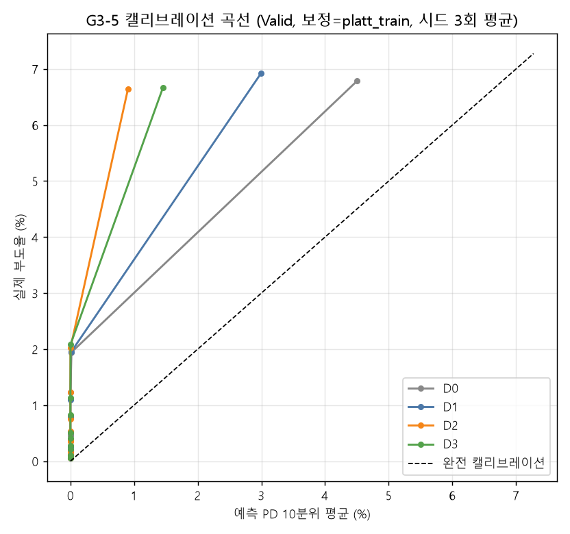
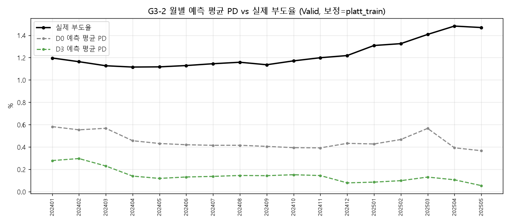

# STAGE 6 D축 — 거시 결합 방식 Ablation 결과

실행일: 2026-08-31 · 규제 **R2** (A/B/C축과 동일) · 시드 3회 (42/7/2024)
기준서: `eda_pipeline/output/validation/D_AXIS_SUCCESS_CRITERIA.md` (**개정 R1**)
게이트 1: `eda_pipeline/output/validation/D_AXIS_GATE1_RESULT.md` — **8/8 통과**
재현: `python -m eda_pipeline.step34_d_axis --run-all --seeds 42,7,2024`
원자료: `d_axis/d_axis_results.json` · `d_axis/d_axis_summary.json`

---

## 0. 이 표를 읽는 법

> **AUC 로 거시를 판정하지 않는다.** AUC 는 동일 시점 내 순위 지표이고,
> 거시는 모든 기업을 같은 방향으로 이동시켜 순위를 거의 바꾸지 않는다.
> 거시의 가치는 AUC 오른쪽 컬럼(PD-부도율 상관 / 건수 MAPE / Brier)에 있다.

> ★ **`rate_shock_x_leverage` 는 정책금리 동결 구간에서 구조적으로 0 이 된다.**
> 이 항의 gain 이 낮게 나오더라도 '금리 경로가 무의미하다'는 뜻이 아니라
> '분석 기간의 절반이 금리 변동이 없는 구간'이라는 뜻이다.
> 실측: Valid 312,334행 중 **53.14%** 에서 이 항이 0.
> gain 은 반드시 아래 §3 의 '0 비율' 컬럼과 함께 읽는다.

### 확률 보정

결과표의 캘리브레이션 지표는 **`platt_train`** 적용 후 값이다. AUC 는 단조변환에 불변이라 보정과 무관하다.

| 방식 | 적합 구간 | D0 평균 PD | 채택 |
|---|---|---:|:---:|
| 실제 부도율 (Valid) | — | **1.2269%** | — |
| `raw` (보정 없음) | — | 9.0636% | 대조군 |
| `prior` (해석적 역변환) | Train spw | 0.2314% | 부보정 |
| `platt_train` | Train ~202309 | 0.4524% | **주보정** |
| `platt_dev` | Dev 202310~202312 | 1.1065% | 참고 |

- `prior correction` 은 가중 학습이 부풀린 양성 오즈의 해석적 역변환이다 (`p/(p+(1-p)·spw)`). 적합 파라미터가 없어 과적합이 불가능하지만, R2 규제(`num_leaves=7, reg_alpha=5, reg_lambda=5`)로 트리 확률이 수축돼 있어 **과소보정된다.**
- `platt_train` 은 기준서의 *"보정은 Train 구간에서만 학습해 Valid 에 적용"* 을 문자 그대로 만족한다. **D0 에서 평균 PD 가 실제보다 낮게 나오는 것은 결함이 아니라 측정 그 자체다** — Train 기저율 0.9116% 에서 Valid 1.2269% 로의 상승분을 기업 고유 피처만으로는 따라가지 못한다는 뜻이고, 거시가 메워야 하는 지점이 정확히 여기다.
- `platt_dev` 는 Dev(202310~202312)가 Valid 와 시기가 인접해 기저율이 비슷하므로 (Dev 1.2424% vs Valid 1.2269%) 절편이 Valid 기저율을 대신 알려 주는 효과가 있다. 거시가 없어도 캘리브레이션이 좋아 보여 판정이 무뎌지므로 참고용으로만 둔다. §5 에 로버스트니스로 병기한다.
- 보정 방식은 D0~D5 에 **동일하게** 적용되므로 시나리오 간 비교는 공정하다.

---

## 1. D0~D5 결과표

| ID | 구성 | 피처수 | Valid AUC(σ) | ΔAUC | 거시gain% | PD-부도율 상관 | 건수 MAPE | Brier | 판정 |
|---|---|---:|---:|---:|---:|---:|---:|---:|:---:|
| **D0** | 기준선. 거시·상호작용 전부 제외 (기업 고유 + 노출도만) | 156 | 0.8448 (0.0006) | — | 0.00 | -0.1267 (0.0346) | 62.78% (0.78) | 0.011862 | 기준선 |
| **D1** | D0 + 거시 원본만 (상호작용 없음) — 시점 더미 팔 | 247 | 0.8467 (0.0013) | +0.0019 | 1.47 | -0.3659 (0.0158) | 75.14% (2.89) | 0.011843 | 실패 |
| **D2** | D0 + 상호작용 8종만 (거시 원본 없음) — STAGE 5 설계 팔 | 164 | 0.8386 (0.0021) | -0.0062 | 1.43 | -0.4169 (0.0255) | 92.42% (0.35) | 0.011817 | 실패 |
| **D3** | D0 + 거시 원본 + 상호작용 8종 (완전형) | 255 | 0.8412 (0.0019) | -0.0036 | 2.15 | -0.4567 (0.0934) | 87.84% (2.71) | 0.011792 | 실패 |
| **D4** | D3 에서 수출 노출도 실측 -> 하이브리드 (fx actual vs hybrid) | 255 | 0.8375 (0.0007) | -0.0072 | 2.10 | -0.4329 (0.0251) | 89.31% (0.66) | 0.011750 | 실패 |
| **D5** | D3 에서 거시 축소 해제 (91 -> 178 전부) | 342 | 0.8376 (0.0024) | -0.0071 | 2.22 | -0.4575 (0.0650) | 90.80% (0.61) | 0.011776 | 실패 |

- 노이즈 규칙: `|ΔAUC| < 0.003` 은 **차이 없음**으로 기술한다.
- 괄호 안은 시드 3회 표준편차.
- 거시gain% = (거시 원본 + 상호작용) gain 합계 / 전체 gain.

---

## 2. 게이트 2 — 거시 작동 여부 (구조 검증)

### G2-1 — D3 의 거시 gain 합계 비중

| 구분 | 거시 gain 합계 |
|---|---:|
| 원본 모델 (`lgbm_12m_model.txt`, 누수 포함) | 5.12% |
| **D3 (거시 원본 + 상호작용 8종)** | **2.15%** (σ 0.08) |

**판정: 미달** — 원본 대비 -2.97%p

### G2-2 — 상호작용 8종 중 gain 상위 30위 진입 개수

D3 기준 **1개** (기대 3개 이상) → **미달**

### G2-3 — D1(거시 원본만) vs D2(상호작용만)

| ID | 구성 | 거시 피처수 | 거시gain% | Valid AUC | PD-부도율 상관 | 건수 MAPE |
|---|---|---:|---:|---:|---:|---:|
| D1 | D0 + 거시 원본만 (상호작용 없음) — 시점 더미 팔 | 91 | 1.47% | 0.8467 | -0.3659 | 75.14% |
| D2 | D0 + 상호작용 8종만 (거시 원본 없음) — STAGE 5 설계 팔 | 8 | 1.43% | 0.8386 | -0.4169 | 92.42% |

**D2 <= D1** (1.43% vs 1.47%) → ★ 상호작용 설계를 재검토해야 한다.

주의: D1 은 거시 91개, D2 는 상호작용 8개다. **피처 1개당 기여**로 보면 D1 0.016%p, D2 0.179%p 다.

### G2-4 — 거시 변수 gain 상위 10개와 경제 채널

D3 / 시드 42 기준.

| 순위(전체) | 거시 변수 | gain% | 경제 채널 |
|---:|---|---:|---|
| 23 | `rate_shock_x_leverage` | 0.888 | 금리-차입 (정책금리 충격 x 차입금의존도) |
| 57 | `CPI_core_yoy` | 0.150 | 물가 (전년동월비) |
| 58 | `credit_spread_x_lev` | 0.148 | 금리-차입 (신용스프레드 x 차입금의존도) |
| 59 | `housing_price_index_yoy` | 0.122 | 부동산-건설 (전년동월비) |
| 64 | `import_index_yoy_ma3m` | 0.077 | 환율-수출 (3개월 이동평균, 전년동월비) |
| 65 | `corn_log_ret_ma3m` | 0.073 | 유가-원자재 (3개월 이동평균, 월간 수익률) |
| 67 | `BSI_nonmfg_biz_yoy_ma3m` | 0.063 | 심리지수 (3개월 이동평균, 전년동월비) |
| 72 | `BSI_nonmfg_biz_yoy` | 0.040 | 심리지수 (전년동월비) |
| 73 | `soybean_log_ret_ma3m` | 0.040 | 유가-원자재 (3개월 이동평균, 월간 수익률) |
| 77 | `trade_total_yoy` | 0.036 | 환율-수출 (전년동월비) |

---

## 3. 상호작용항 gain — **반드시 0 비율과 함께 읽는다**

| 상호작용 | 경제 채널 | gain% | 순위(전체) | **충격0 개월** | **충격0 행%** | **충격0 Valid행%** | 노출도공백 |
|---|---|---:|---:|---:|---:|---:|---:|
| `fx_shock_x_export` | 환율-수출 (원/달러 충격 x 수출비중) | 0.000 | 255 | 0 | 0.00% | 0.00% | 3개월 |
| `fx_vol_x_fxdebt` | 환율-외화부채 (환변동성 x 외화부채비중) | 0.017 | 93 | 0 | 0.00% | 0.00% | 0개월 |
| `eur_shock_x_export` | 환율-수출 (원/유로 충격 x 수출비중) | 0.003 | 143 | 0 | 0.00% | 0.00% | 3개월 |
| `rate_shock_x_leverage` | 금리-차입 (정책금리 충격 x 차입금의존도) | 0.888 | 23 | 12 | 22.67% | 53.14% | 0개월 |
| `credit_spread_x_lev` | 금리-차입 (신용스프레드 x 차입금의존도) | 0.148 | 58 | 0 | 0.00% | 0.00% | 0개월 |
| `liq_spread_x_shortdebt` | 금리-유동성 (유동성스프레드 x 단기부채비중) | 0.015 | 96 | 0 | 0.00% | 0.00% | 0개월 |
| `oil_shock_x_inv` | 유가-재고 (유가 충격 x 재고부담) | 0.012 | 107 | 0 | 0.00% | 0.00% | 0개월 |
| `bsi_x_industry` | 심리지수-업종 (제조업 BSI x 제조업 여부) | 0.025 | 84 | 1 | 1.92% | 5.83% | 0개월 |

> `rate_shock_x_leverage` 의 gain 을 다른 항과 나란히 비교하면 안 된다. Valid 의 **53.14%** 에서 이 항은 전 기업 0 이고, 트리는 그 구간에서 이 변수로 분기할 수 없다. 금리 경로는 `credit_spread_x_lev` 와 `liq_spread_x_shortdebt` 가 커버한다 (두 항 모두 충격 0 인 달 0개).

---

## 4. 게이트 3 — 실질 가치 (캘리브레이션)

| ID | 지표 | D0 | D1 | D2 | D3 | D4 | D5 |
|---|---|---:|---:|---:|---:|---:|---:|
| G3-1 | Valid AUC | 0.8448 | 0.8467 (+0.0019) | 0.8386 (-0.0062) | 0.8412 (-0.0036) | 0.8375 (-0.0072) | 0.8376 (-0.0071) |
| G3-2 | PD-부도율 상관 ★ | -0.1267 | -0.3659 (-0.2392) | -0.4169 (-0.2902) | -0.4567 (-0.3300) | -0.4329 (-0.3062) | -0.4575 (-0.3308) |
| G3-3 | 건수 MAPE ★ | 62.78% | 75.14% (+12.35) | 92.42% (+29.63) | 87.84% (+25.05) | 89.31% (+26.53) | 90.80% (+28.01) |
| G3-4 | Brier | 0.011862 | 0.011843 (-0.000019) | 0.011817 (-0.000045) | 0.011792 (-0.000070) | 0.011750 (-0.000112) | 0.011776 (-0.000086) |
| G3-5 | ECE (대각선 평균거리) | 0.007745 | 0.009262 (+0.001517) | 0.011364 (+0.003619) | 0.010811 (+0.003066) | 0.010993 (+0.003248) | 0.011172 (+0.003426) |

괄호 = D0 대비 변화. 상관은 클수록, MAPE·Brier·ECE 는 작을수록 좋다.

### 시드 표준편차

| ID | AUC σ | 상관 σ | MAPE σ | Brier σ | ECE σ |
|---|---:|---:|---:|---:|---:|
| D0 | 0.0006 | 0.0346 | 0.78 | 0.000019 | 0.000093 |
| D1 | 0.0013 | 0.0158 | 2.89 | 0.000079 | 0.000352 |
| D2 | 0.0021 | 0.0255 | 0.35 | 0.000023 | 0.000042 |
| D3 | 0.0019 | 0.0934 | 2.71 | 0.000030 | 0.000329 |
| D4 | 0.0007 | 0.0251 | 0.66 | 0.000053 | 0.000080 |
| D5 | 0.0024 | 0.0650 | 0.61 | 0.000045 | 0.000077 |

### 월별 예측 PD vs 실제 부도율 (D0 vs D3, 시드 3회 평균)

| BASE_YM | 행수 | 실제 부도건수 | 실제 부도율 | D0 예측건수 | D3 예측건수 | D0 오차 | D3 오차 |
|---|---:|---:|---:|---:|---:|---:|---:|
| 202401 | 18,554 | 222 | 1.197% | 108.1 | 51.7 | -51.3% | -76.7% |
| 202402 | 18,566 | 216 | 1.163% | 102.8 | 55.1 | -52.4% | -74.5% |
| 202403 | 18,543 | 209 | 1.127% | 105.3 | 42.7 | -49.6% | -79.6% |
| 202404 | 18,557 | 207 | 1.115% | 84.7 | 25.9 | -59.1% | -87.5% |
| 202405 | 18,528 | 207 | 1.117% | 79.9 | 22.0 | -61.4% | -89.4% |
| 202406 | 18,424 | 208 | 1.129% | 77.4 | 24.3 | -62.8% | -88.3% |
| 202407 | 18,423 | 211 | 1.145% | 76.5 | 25.2 | -63.7% | -88.0% |
| 202408 | 18,386 | 213 | 1.158% | 76.4 | 26.7 | -64.1% | -87.5% |
| 202409 | 18,396 | 209 | 1.136% | 74.6 | 26.4 | -64.3% | -87.4% |
| 202410 | 18,362 | 215 | 1.171% | 72.4 | 27.9 | -66.3% | -87.0% |
| 202411 | 18,348 | 220 | 1.199% | 72.0 | 26.5 | -67.3% | -88.0% |
| 202412 | 18,221 | 222 | 1.218% | 78.8 | 14.4 | -64.5% | -93.5% |
| 202501 | 18,191 | 238 | 1.308% | 77.7 | 15.6 | -67.4% | -93.5% |
| 202502 | 18,189 | 241 | 1.325% | 84.9 | 17.9 | -64.8% | -92.6% |
| 202503 | 18,188 | 256 | 1.408% | 103.1 | 23.8 | -59.7% | -90.7% |
| 202504 | 18,216 | 270 | 1.482% | 71.6 | 19.4 | -73.5% | -92.8% |
| 202505 | 18,242 | 268 | 1.469% | 66.9 | 10.0 | -75.0% | -96.3% |

### 측정 근거 — 연도별 실제 부도율 (기준서)

| 연도 | 2021 | 2022 | 2023 | 2024 | 2025 |
|---|---:|---:|---:|---:|---:|
| 실제 부도율 | 0.671% | 0.904% | 1.24% | 1.176% | 1.417% |

최저 대비 최고 **2.1배 변동**. 거시가 설명해야 할 구간이다.

---

## 5. ★ 원인 규명 — 거시-부도 관계의 부호가 Train 과 Valid 에서 뒤집힌다

거시 지표는 `BASE_YM` 하나당 값이 하나뿐이다. 따라서 모델이 거시로부터
배울 수 있는 **실질 표본은 행수 948,214 가 아니라 월 수 53 개**다.
그 53개월 안에 금리 사이클이 한 번(2021 인상 개시 → 2022~23 급등 →
2024 동결 → 2024-12 인하 전환) 들어 있을 뿐이다.

### 5-1. 월별 12개월 선행 부도율과 거시 지표의 상관

| 거시 변수 | 경제 채널 | Train 상관 | Valid 상관 | 전체 | 부호 |
|---|---|---:|---:|---:|:---:|
| `base_rate_diff12` | 금리-차입 (12개월 차분) | +0.904 | -0.909 | +0.206 | **★ 뒤집힘** |
| `credit_spread_diff12` | 금리-차입 (12개월 차분) | +0.755 | -0.454 | +0.367 | **★ 뒤집힘** |
| `liquidity_spread_diff12` | 금리-차입 (12개월 차분) | +0.475 | -0.749 | +0.002 | **★ 뒤집힘** |
| `USD_KRW_log_ret` | 환율-수출 (월간 수익률) | -0.086 | -0.396 | -0.172 | 유지 |
| `BSI_mfg_biz_yoy` | 심리지수 (전년동월비) | -0.757 | -0.760 | -0.671 | 유지 |
| `CPI_core_yoy` | 물가 (전년동월비) | -0.957 | +0.420 | -0.894 | **★ 뒤집힘** |
| `KOSPI_log_ret` | 주가 (월간 수익률) | +0.086 | +0.296 | +0.143 | 유지 |
| `housing_price_index_yoy` | 부동산-건설 (전년동월비) | -0.957 | +0.855 | -0.906 | **★ 뒤집힘** |
| `WTI_crude_oil_log_ret` | 유가-원자재 (월간 수익률) | -0.161 | -0.248 | -0.273 | 유지 |

**금리 계열 3종이 전부 뒤집힌다.** `base_rate_diff12` 는 Train 에서 **+0.904**,
Valid 에서 **−0.909** 다. 거의 완전한 부호 반전이다.

| 구간 | 개월 | 12개월 선행 부도율 | `base_rate_diff12` |
|---|---:|---|---|
| TRAIN | 33 | 평균 0.899% (0.637~1.261%) | 평균 +0.894 (-0.750~+2.250) |
| DEV | 3 | 평균 1.242% (1.234~1.251%) | 평균 +0.833 (+0.500~+1.000) |
| VALID | 17 | 평균 1.228% (1.115~1.482%) | 평균 -0.162 (-0.750~+0.250) |

### 5-2. 그래서 무슨 일이 벌어졌나

1. 모델은 Train(2021~2023)에서 **"금리가 오르면 부도가 는다"** 를 배운다
   (상관 +0.90). 경제학적으로 맞는 관계다.
2. Valid(2024~2025)에서는 금리가 **내려간다** (diff12 평균 −0.162, 2024-12 부터
   인하 전환). 모델은 배운 대로 **PD 를 낮춘다.**
3. 그런데 실제 부도율은 **계속 오른다** (1.115% → 1.482%). 2022~23 긴축의
   충격이 기업 재무를 갉아먹는 데 시간이 걸리기 때문이다 — **부도는 거시에**
   **후행한다.**
4. 결과: 거시를 넣을수록 예측 PD 가 실제와 **반대 방향**으로 움직인다.
   D0 상관 −0.127 → D3 −0.457, 건수 MAPE 62.78% → 87.84%.

§4 의 월별 표가 이것을 그대로 보여 준다. D3 예측 부도건수는
202401 51.7건 → 202505 10.0건으로 **줄어드는데**, 실제는 222건 → 268건으로
**늘었다**. D0(거시 없음)는 같은 구간에서 108.1 → 66.9 로 덜 줄어든다.

**상호작용항도 이 문제를 못 고친다.** STAGE 5 의 상호작용 설계가 해결한 것은
'시점 더미로의 퇴화'였다. 그런데 상호작용항은 같은 거시 충격에 기업 노출도를
곱한 것이라 **충격의 부호를 그대로 물려받는다.** 금리가 내려가면
`rate_shock_x_leverage` 도 음수가 되고, 차입 의존도가 높은 기업일수록 PD 가
더 크게 내려간다. 방향이 틀린 신호를 더 정교하게 배분한 셈이다.

### 5-3. 시차를 더 주면 부호가 맞춰지는가 (가설, 검증 안 됨)

거시에 추가 시차 k 개월을 주고 상관을 다시 쟀다.

| 거시 변수 | 구간 | k=0 | k=3 | k=6 | k=9 | k=12 | k=15 | k=18 | k=21 | k=24 |
|---|---|---:|---:|---:|---:|---:|---:|---:|---:|---:|
| `base_rate_diff12` | Train | +0.904 | +0.975 | +0.979 | +0.954 | +0.945 | +0.972 | +0.930 | +0.941 | +0.734 |
| | Valid | -0.909 | -0.601 | -0.476 | -0.662 | -0.861 | -0.977 | -0.687 | +0.304 | +0.742 |
| `credit_spread_diff12` | Train | +0.755 | +0.940 | +0.955 | +0.953 | +0.955 | +0.942 | +0.893 | +0.853 | +0.512 |
| | Valid | -0.454 | -0.327 | +0.487 | -0.057 | -0.576 | -0.755 | -0.780 | -0.291 | +0.769 |
| `liquidity_spread_diff12` | Train | +0.475 | +0.674 | +0.737 | +0.657 | +0.591 | +0.524 | +0.385 | +0.143 | -0.550 |
| | Valid | -0.749 | -0.230 | +0.180 | +0.338 | +0.081 | -0.490 | -0.779 | -0.369 | +0.109 |
| `USD_KRW_log_ret` | Train | -0.086 | -0.138 | -0.115 | -0.085 | +0.277 | +0.125 | -0.056 | -0.033 | -0.199 |
| | Valid | -0.396 | +0.157 | +0.107 | -0.156 | +0.114 | +0.146 | -0.069 | -0.045 | -0.086 |
| `BSI_mfg_biz_yoy` | Train | -0.757 | -0.807 | -0.737 | -0.679 | -0.561 | -0.292 | +0.027 | +0.627 | +0.732 |
| | Valid | -0.760 | -0.221 | +0.455 | +0.643 | +0.870 | +0.834 | +0.552 | -0.136 | -0.631 |

`base_rate_diff12` 는 **k=24 에서만** Train(+0.734) 과 Valid(+0.742) 의 부호가
맞는다. `credit_spread_diff12` 도 k=24 에서 +0.512 / +0.769 다. 긴축 충격이
부도로 이어지는 데 2년쯤 걸린다는 뜻이고, 타겟이 이미 12개월 선행이므로
충격에서 부도까지 실질 24~36개월이 된다. 경제학적으로 무리한 값은 아니다.

**그러나 이것을 지금 채택해서는 안 된다:**

- k 를 **Valid 상관을 보고 골랐다.** 그 자체가 홀드아웃 오염이다.
- 판단 근거가 되는 표본이 Valid 17개월 / Train 33개월뿐이다. 사이클이 하나라
  53개월 안에서 고른 시차는 그 한 번의 사이클에 과적합된다.
- k=24 면 거시 원천이 202101 부터이므로 패널 202301 이전 행에 거시가 없다.
  Train 의 절반이 날아간다.

→ **제안만 하고 승인을 받는다. 임의로 적용하지 않는다.**
   검증하려면 최소 2개 이상의 금리 사이클을 덮는 기간(2008 금융위기,
   2010년대 저금리기 포함)으로 거시와 부도 이력을 함께 확장해야 한다.

### 5-4. 부호가 유지되는 지표도 있다

| 거시 변수 | 경제 채널 | Train | Valid |
|---|---|---:|---:|
| `USD_KRW_log_ret` | 환율-수출 (월간 수익률) | -0.086 | -0.396 |
| `BSI_mfg_biz_yoy` | 심리지수 (전년동월비) | -0.757 | -0.760 |
| `KOSPI_log_ret` | 주가 (월간 수익률) | +0.086 | +0.296 |
| `WTI_crude_oil_log_ret` | 유가-원자재 (월간 수익률) | -0.161 | -0.248 |

`BSI_mfg_biz_yoy`(제조업 업황 BSI)는 Train −0.757 / Valid −0.760 으로
**부호와 크기가 모두 안정적**이다. 심리지수는 금리처럼 정책 결정으로
계단 변동하지 않고, 기업이 체감하는 업황을 동행적으로 반영하기 때문으로
보인다. 거시를 다시 설계한다면 **가격 변수(금리·환율)보다 심리·업황**
**지표를 축으로 삼는 편**이 유망하다는 단서다. 다만 이것도 위와 같은
표본 한계를 공유하므로 단서 이상으로 취급하지 않는다.

---

## 6. 로버스트니스 — 보정 방식을 바꾸면

| ID | `platt_train` 상관 | `platt_dev` 상관 | `platt_train` MAPE | `platt_dev` MAPE |
|---|---:|---:|---:|---:|
| D0 | -0.1267 | -0.1407 | 62.78% | 9.85% |
| D1 | -0.3659 | -0.5704 | 75.14% | 38.50% |
| D2 | -0.4169 | -0.6547 | 92.42% | 48.63% |
| D3 | -0.4567 | -0.6650 | 87.84% | 56.66% |
| D4 | -0.4329 | -0.6797 | 89.31% | 58.24% |
| D5 | -0.4575 | -0.7066 | 90.80% | 57.39% |

PD-부도율 상관은 단조 보정에 **불변**이다 (월별 평균은 엄밀히는 아니지만 실질적으로 순위가 유지된다). 건수 MAPE 는 수준(level) 지표라 보정 방식에 민감하다. 두 보정에서 **부호가 같은 결론**이 나오면 판정이 견고하다.

---

## 7. 최종 판정

기준서 판정 규칙:

| 판정 | 조건 |
|---|---|
| 성공 | 게이트 1 전부 통과 + G3-1 유지 + (G3-2 **또는** G3-3 개선) |
| 부분성공 | 게이트 1 통과 + AUC 유지 + 캘리브레이션 무변화 |
| 실패 | AUC 가 0.003 초과 하락하거나 캘리브레이션 악화 |

| ID | 판정 | 근거 |
|---|:---:|---|
| D0 | **기준선** | 모든 Δ 의 기준 |
| D1 | **실패** | AUC 유지(+0.0019)이나 캘리브레이션 악화 — 상관 -0.2392 (2σ 0.0760 초과 하락) / MAPE +12.35%p (2σ 5.98 초과 상승) |
| D2 | **실패** | AUC -0.0062 (노이즈대 −0.003 초과 하락) / 상관 -0.2902 / MAPE +29.63%p |
| D3 | **실패** | AUC -0.0036 (노이즈대 −0.003 초과 하락) / 상관 -0.3300 / MAPE +25.05%p |
| D4 | **실패** | AUC -0.0072 (노이즈대 −0.003 초과 하락) / 상관 -0.3062 / MAPE +26.53%p |
| D5 | **실패** | AUC -0.0071 (노이즈대 −0.003 초과 하락) / 상관 -0.3308 / MAPE +28.01%p |

