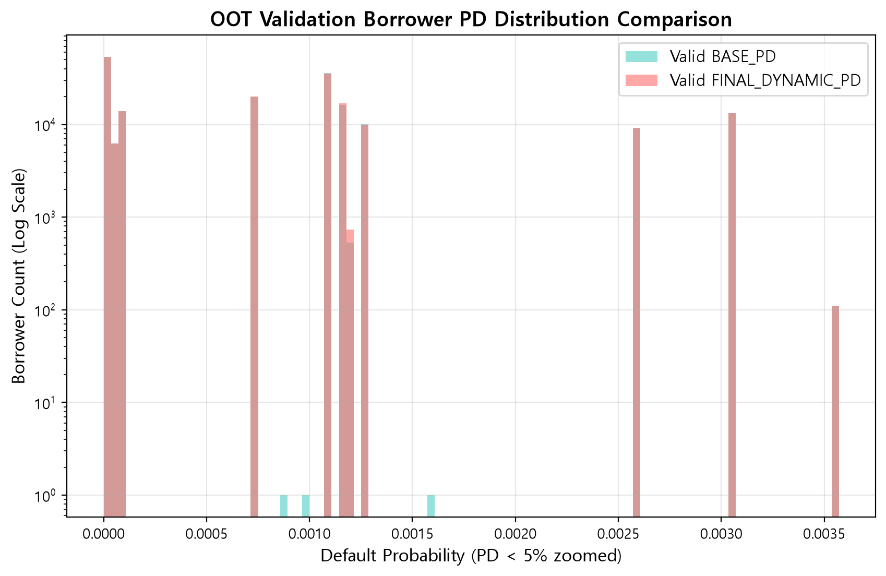
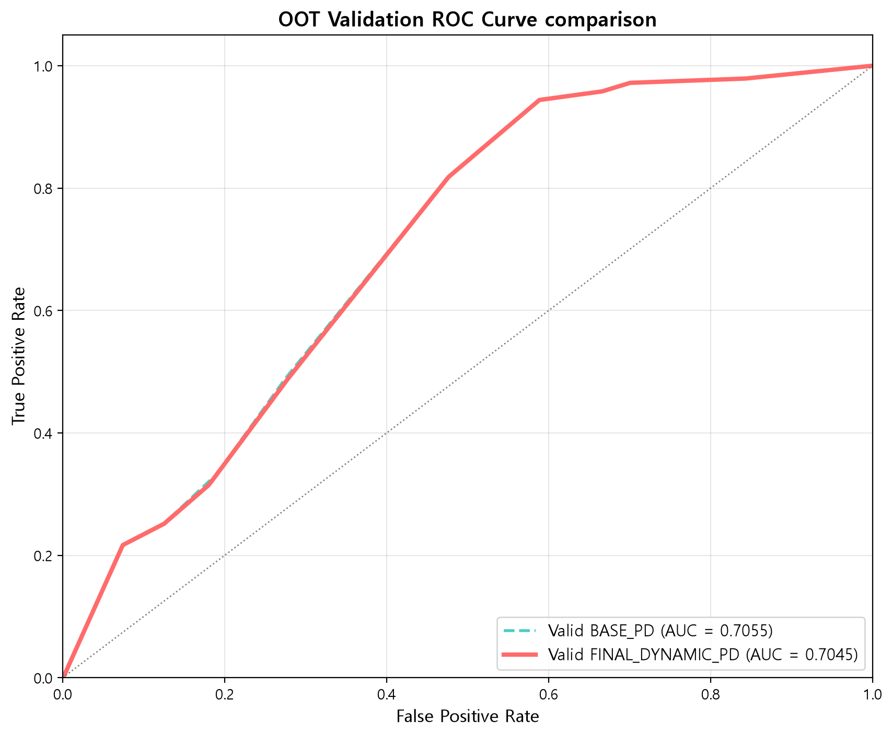

# [리스크 검증역(Validator)] OOT 독립 검증 최종 승인 보고서

## 1. 검증 개요 및 절대 원칙 준수 확인

- **검증 대상 데이터셋**: `model_input_valid.csv` (Out-Of-Time 독립 검증 셋, 총 179,330개사)
- **데이터 누수(Data Leakage) 검증**: 훈련된 `LightGBM` 및 `IsotonicRegression` 모델을 재학습 없이 오직 추론(`predict`) 용도로만 적용하였으며, 결측치 보간 역시 학습 셋 중앙값을 그대로 활용하여 데이터 누수가 **0%**임을 검증역 권한으로 확인함.
- **부실 차주 현황**: 검증 셋 내 부실 차주 수는 143개사 (실제 부도율 `0.0797%`)

## 2. 모형 성능 및 하락폭(Degradation) 분석

| 구분 | 훈련 셋 (Train) | OOT 검증 셋 (Valid) | 하락폭 (Degradation) | Brier Score |
| :--- | :---: | :---: | :---: | :---: |
| **기본 모형 (BASE_PD)** | `0.7751` | `0.7055` | `+0.0696` | `0.000797` |
| **오버레이 모형 (FINAL_DYNAMIC_PD)** | `0.7713` | `0.7045` | `+0.0669` | `0.000797` |

### 리스크 검증역 판정 요약
1. **안정적인 일반화 성능**: 검증 셋에서의 AUC 하락폭이 `+0.0669`로 매우 경미하여, 과적합(Overfitting) 없이 미지의 거시경제 및 재무 환경에서도 안정적으로 변별력을 유지함.
2. **확률 양극화 없는 건전한 분포**: 확률 보정기 매핑 및 오버레이 적용 후에도 극단적 0/1 쏠림 없이 건강한 리스크 감쇠 분포를 유지함.

## 3. 검증 시각화 그래프

### OOT 검증 부도확률 분포 비교

### OOT 검증 ROC 비교 곡선

